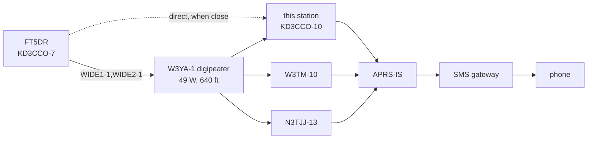
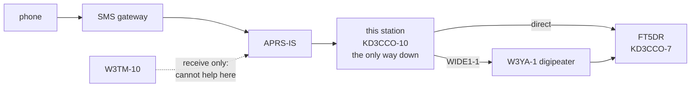
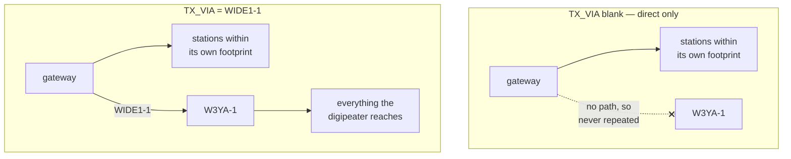

# Bidirectional APRS iGate

A strict-whitelist APRS iGate: packets heard on 144.390 are gated up to
APRS-IS, and **only** APRS *messages* addressed to whitelisted callsigns are
ever transmitted back onto RF. Everything else — positions, telemetry, other
people's traffic — is silently dropped.

One editable config file drives everything, in either of two deployment modes.

| Mode | Runs as | Intended host |
|---|---|---|
| `docker` (default) | A locked-down container: all capabilities dropped, read-only rootfs, non-root, filtered egress, only the radio's own device nodes | A workstation that does other things too, where isolating the gateway is worth the overhead |
| `bare-metal` | Direwolf directly on the host under `systemd`, with `rigctld` for a radio that has CAT | A single-purpose appliance — nothing to isolate it from, and no RAM to spend on a container runtime |

Both have carried live traffic in both directions. The mode is set per machine,
with `DEPLOY_MODE` in that machine's `igate.local.conf`; with no such file it is
`docker`. A single run can override it with `IGATE_MODE=bare-metal`.

## The pi-gate

The bare-metal target is a **Raspberry Pi 3B+** — a "pi-gate": a box you plug in
and forget, with no keyboard and no monitor. Either radio goes straight into one
of its four USB ports.

A Pi 3A+ also runs this, and was the original target, but its single USB port has
no hub chip behind it and will not detect a Digirig Lite without a powered hub.
That board's constraints are recorded in §15 and §16.6 of the
[design document](aprs-igate-prototype-test.md); the rest of this file assumes a
3B+.

`build_pi_image.sh` builds the SD card image for it. Set your WiFi credentials
and callsign on your laptop, write the card, and the Pi comes up on its own:
joins WiFi, enables SSH, installs Direwolf and hamlib, and starts gating — with
no console session at any point. You manage it entirely over the network.

```bash
./build_pi_image.sh check     # validate settings
./build_pi_image.sh build     # produce the image
./build_pi_image.sh flash /dev/sdX
```

**[PI-SETUP.md](PI-SETUP.md) is the full walkthrough**, blank card to gateway on
the air, written for someone who has never used a Raspberry Pi. It also covers
running the monitor and editing the whitelist over SSH, and has an appendix on
how the image is customised offline by loop-mounting it (no Raspberry Pi Imager
involved).

## Documents in this repo

| File | What it is |
|---|---|
| [README.md](README.md) | This file: what the gateway does, how to configure and operate it, both modes |
| [PI-SETUP.md](PI-SETUP.md) | Step-by-step pi-gate build, from SD card to on-air, plus day-to-day operation over SSH |
| [aprs-igate-prototype-test.md](aprs-igate-prototype-test.md) | Design document. §13 what was built, §14 constraints of Direwolf and the radio that the design has to work around, §15 limitations and future work, §16 the headless Pi deployment |
| `igate.conf` | The station: callsign, whitelist, beacon, APRS-IS login, which radio. Identical on every machine |
| `radios/<name>.conf` | Radio profiles: how to drive one radio — audio device, mixer levels, CAT, PTT. `ftx1` and `vx6r` |
| `udev/99-igate-cm108.rules` | Lets the `audio` group key a CM108 interface such as the Digirig Lite. Installed on the host by hand, or by the Pi image |
| `igate.local.conf.example` | Template for `igate.local.conf`: settings for one machine only (gitignored) |
| `igate.test.conf` | A ready-made forced-digipeat-path test that leaves `igate.conf` alone |
| `pi.conf`, `pi.secrets.example` | Image build settings and the credential template |

## Contents

- [The pi-gate](#the-pi-gate)
- [Documents in this repo](#documents-in-this-repo)
- [Quickstarts](#quickstarts)
  - [Quickstart A — laptop · docker · Yaesu FTX-1](#quickstart-a--laptop--docker--yaesu-ftx-1)
  - [Quickstart B — Raspberry Pi (pi-gate) · bare-metal · Yaesu FTX-1](#quickstart-b--raspberry-pi-pi-gate--bare-metal--yaesu-ftx-1)
  - [Quickstart C — laptop · docker · Yaesu VX-6R on a Digirig Lite](#quickstart-c--laptop--docker--yaesu-vx-6r-on-a-digirig-lite)
  - [Quickstart D — Raspberry Pi (pi-gate) · bare-metal · Yaesu VX-6R on a Digirig Lite](#quickstart-d--raspberry-pi-pi-gate--bare-metal--yaesu-vx-6r-on-a-digirig-lite)
- [Radio setup — the one that matters](#radio-setup--the-one-that-matters)
- [Commands](#commands)
- [Monitoring](#monitoring)
- [Web monitor (LAN)](#web-monitor-lan)
- [Testing it](#testing-it)
- [Configuration](#configuration)
- [Safety notes](#safety-notes)
- [Deployment modes](#deployment-modes)
- [Running it on a Raspberry Pi (the pi-gate)](#running-it-on-a-raspberry-pi-the-pi-gate)
- [Tearing it down](#tearing-it-down)
- [Appendix — How a message travels](#appendix--how-a-message-travels)

---

## Quickstarts

Pick the one that matches your hardware. Each is complete on its own.

| Quickstart | Computer | Mode | Radio |
|---|---|---|---|
| [A](#quickstart-a--laptop--docker--yaesu-ftx-1) | Linux laptop or desktop | `docker` | Yaesu FTX-1 |
| [B](#quickstart-b--raspberry-pi-pi-gate--bare-metal--yaesu-ftx-1) | Raspberry Pi 3B+ (the pi-gate) | `bare-metal` | Yaesu FTX-1 |
| [C](#quickstart-c--laptop--docker--yaesu-vx-6r-on-a-digirig-lite) | Linux laptop or desktop | `docker` | Yaesu VX-6R on a Digirig Lite |
| [D](#quickstart-d--raspberry-pi-pi-gate--bare-metal--yaesu-vx-6r-on-a-digirig-lite) | Raspberry Pi 3B+ (the pi-gate) | `bare-metal` | Yaesu VX-6R on a Digirig Lite |

| Radio | Profile | Frequency and mode | PTT | State |
|---|---|---|---|---|
| Yaesu FTX-1 | `radios/ftx1.conf` | set and checked by `up` over CAT | CAT command, through `rigctld` | has carried traffic in both modes |
| Yaesu VX-6R on a Digirig Lite | `radios/vx6r.conf` | set by hand; nothing can check it | the Digirig's CM108 GPIO3 | has carried traffic on a laptop (docker) and on a pi-gate (bare-metal) |

**All four start with the station settings,** which are the same on every machine:

```bash
cd aprs_igate_bidirectional_whitelist
cp igate.secrets.example igate.secrets
$EDITOR igate.secrets        # IGLOGIN_PASSCODE — your APRS-IS passcode
$EDITOR igate.conf           # MYCALL, IGLOGIN_CALL, WHITELIST_CALLS, BEACON_*
```

`igate.conf` says `RADIO = ftx1`, the station's usual radio. A machine with the
VX-6R selects it for itself, as Quickstarts C and D show, so `igate.conf` stays the
same everywhere. Leave `DEPLOY_MODE` out of it too: the mode belongs to the machine.

**Then prepare the radio** from its front panel.

*FTX-1 (A, B).* `up` sets 144.390 MHz and **D-FM** over CAT on every start. D-FM
matters: in plain FM the radio transmits from the microphone, not USB, and nothing
can decode it. The rest `up` cannot set:

- **Time-out timer** set to 3 minutes. It is the only thing that unkeys the
  radio if USB drops mid-transmission. See [Safety notes](#safety-notes).
- **USB MOD GAIN** (under data-mode settings) at a sane level, and power and
  antenna as you want them.

*VX-6R (C, D).* It has no CAT, so everything is by hand and nothing checks it.
Set Mode item numbers are from Yaesu's manual (press **F/W**, then **0(SET)**,
turn the DIAL to the item). Details are in
[Radio setup](#yaesu-vx-6r-on-a-digirig-lite).

- **144.390 MHz, FM.**
- **53 `RXSAVE` = OFF.** The manual's own packet advice: the battery saver's sleep
  cycle cuts off the start of incoming packets.
- **67 `TOT` on** (factory 3 minutes), and **1 `APO` = OFF** (factory default).
- **Squelch low, volume low.** The VOL knob is the receive level into the Digirig.
- **DC power** for anything longer than a test (Yaesu E-DC-5B or E-DC-6). An
  unattended gateway outlasts the battery. Use a supply of its own, not a USB
  port with a boost cable: a transmitting radio drawing from the same USB supply
  as the Digirig can knock the Digirig off USB.

### Quickstart A — laptop · docker · Yaesu FTX-1

The gateway runs in a locked-down container. The web monitor runs beside it on
the laptop.

**You need:** Docker, usable without `sudo` (`docker ps` works). On the laptop
itself: `alsa-utils` (for `amixer`), `gawk` (for `monitor`), and `python3` (for the
web monitor). The FTX-1 connected by USB.

**1. Check the laptop sees the radio the way the profile expects.**

```bash
arecord -l                         # the FTX-1's codec — note its card number
ls -l /dev/ttyUSB* /dev/ttyACM*    # CAT is a ttyUSB, PTT is a ttyACM
```

`radios/ftx1.conf` expects `ADEVICE = plughw:1,0`, `CAT_DEVICE = /dev/ttyUSB0` and
`PTT_DEVICE = /dev/ttyACM0`. **If they match, this laptop needs no
`igate.local.conf` at all** — `docker` is the default mode, which is why the file
does not exist in a fresh clone. If they differ, override only the differing
values, for this laptop only:

```bash
cp igate.local.conf.example igate.local.conf
$EDITOR igate.local.conf           # uncomment ADEVICE / CAT_DEVICE / PTT_DEVICE
```

**2. Validate, then start.**

```bash
./deploy_igate.sh config           # every resolved setting, and which file set it
sudo -v                            # optional: lets `up` restrict the container's egress
./deploy_igate.sh up               # builds the image on first run, then starts
```

`up` sets the audio levels, starts the container, puts the radio on 144.390 in
FM-D, and starts the web monitor. The last lines look like:

```
iGate up (docker). container=aprs-igate
Radio: 144390000 Hz, mode FM-D
Web monitor: http://localhost:8080/ on this machine, http://192.168.68.67:8080/ from the LAN
```

**3. Watch it.** In the terminal:

```bash
./deploy_igate.sh monitor          # Ctrl+C to leave; the gateway keeps running
```

Or open the web monitor in a browser:

| From | Address |
|---|---|
| The laptop itself | **`http://localhost:8080/`** |
| A phone or another computer on the same WiFi | `http://<laptop-ip>:8080/` — the second address `up` printed, or run `./deploy_igate.sh status` |

`http://aprs-igate.local:8080/` is the **Pi's** address and never reaches the
laptop. From a phone, use the IP address, since Android does not resolve `.local`
names. Then follow [Testing it](#testing-it).

**4. Stop it.**

```bash
./deploy_igate.sh down             # stops the container and the web monitor
```

**After a laptop reboot**, Docker restarts the container by itself, so **the
gateway is back on the air without you doing anything**. The web monitor is not;
it is a plain process on the laptop. Run `./deploy_igate.sh up`: with the gateway
already running, it starts only the monitor.

### Quickstart B — Raspberry Pi (pi-gate) · bare-metal · Yaesu FTX-1

The gateway runs directly on the Pi under systemd, with no container, starting at
power-on. This is the short version; **[PI-SETUP.md](PI-SETUP.md) is the full
walkthrough**, and it explains every step for someone new to the Pi.

**You need:** a Raspberry Pi 3B+, a name-brand microSD card (8 GB or more),
a 5 V 2.5 A supply, and the FTX-1. A Linux laptop with `sudo` builds the card.

**1. On the laptop, configure the image.** The station settings above come along.

```bash
cp pi.secrets.example pi.secrets
$EDITOR pi.secrets                 # PI_USER_PASSWORD, WIFI_1_SSID, WIFI_1_PSK
$EDITOR pi.conf                    # PI_WIFI_COUNTRY (required), PI_SSH_PUBKEY (optional)
./build_pi_image.sh check
```

**Do not create an `igate.local.conf` on the laptop for the Pi.** The build
leaves out the laptop's own copy, if there is one, and writes the Pi its own
containing `DEPLOY_MODE = bare-metal` and `WEB_MONITOR = no`. The second setting
exists because the Pi runs the web monitor as its own systemd service.

**2. Build and write the card.**

```bash
./build_pi_image.sh build          # asks for sudo; about 500 MB download the first time
lsblk                              # find the card by its size
udisksctl unmount -b /dev/sdX1     # if it auto-mounted; repeat per partition
./build_pi_image.sh flash /dev/sdX # sdX is a placeholder — use the name lsblk showed
```

**3. Boot it.** Card into the Pi, then the FTX-1's USB cable into the Pi, then
power last. The first boot installs packages over WiFi and takes **5–10 minutes**.

**4. Log in and check the hardware.**

```bash
ssh-keygen -R aprs-igate.local     # a new card has new host keys
ssh igate@aprs-igate.local
cd aprs-igate
arecord -l                         # the FTX-1's codec — note its card number
ls -l /dev/ttyUSB* /dev/ttyACM*
```

The profile expects card 1 (`plughw:1,0`), `/dev/ttyUSB0` and `/dev/ttyACM0`. If
the Pi differs, set only the differing values in the Pi's `igate.local.conf`:
`nano igate.local.conf`, uncomment and edit.

```bash
./deploy_igate.sh config           # DEPLOY_MODE should be credited to igate.local.conf
sudo systemctl restart aprs-igate  # only needed if you edited igate.local.conf
./deploy_igate.sh status
./deploy_igate.sh monitor
```

**5. The web monitor** is at `http://aprs-igate.local:8080/`, or
`http://<pi-ip>:8080/` from Android. Get the Pi's IP with `hostname -I` on the Pi.

**6. Powering it off:** the image is built to be unplugged. See
[Built to be unplugged](#built-to-be-unplugged) and PI-SETUP.md's shutdown
section.

### Quickstart C — laptop · docker · Yaesu VX-6R on a Digirig Lite

The same container as Quickstart A, with no `rigctld` in it: the VX-6R has no CAT,
and the Digirig keys it from a GPIO pin on its sound chip.

> **On the air.** This setup has carried a full SMS round trip, in both directions,
> with the profile's levels unchanged. Deviation also depends on the cable and the
> radio's `MCGAIN`, so confirm transmit on your own setup (step 5).

**You need:** everything Quickstart A needs, plus a Digirig Lite and Digirig's
VX-6R audio/PTT cable, and `sudo` once for step 2. The VX-6R prepared as above.

**1. Select the VX-6R for this laptop only.**

```bash
cp igate.local.conf.example igate.local.conf    # skip if you already have one
$EDITOR igate.local.conf                        # uncomment: RADIO = vx6r
```

To make the VX-6R the station's radio on every machine instead, change `RADIO` in
`igate.conf`.

**2. Let the `audio` group key the Digirig (once per machine).** Its PTT is a
`/dev/hidraw` node, which only root can open by default:

```bash
sudo cp udev/99-igate-cm108.rules /etc/udev/rules.d/
sudo udevadm control --reload-rules
```

Then unplug the Digirig and plug it back in. Check:

```bash
arecord -l                 # the Digirig is a C-Media USB audio device — note its card number
ls -l /dev/hidraw*         # one node now shows group audio: crw-rw----
```

`radios/vx6r.conf` sets `ADEVICE = auto`, so the card number here does not matter:
the Digirig is found by its USB id (`USB_ID = 0d8c:0012`) at every start, in
whatever port it is in. The hidraw node needs no setting either — it is found on
the same USB device as that card. Two C-Media interfaces on one machine are the
one case auto refuses: it will not guess which is the radio, and says so. Name the
card with `ADEVICE = plughw:N,0` in `igate.local.conf` then.

**3. Validate.**

```bash
./deploy_igate.sh config
```

Look for `RADIO = vx6r (… selected in igate.local.conf)`, `CAT = none`,
`ADEVICE = plughw:N,0 (found by USB_ID 0d8c:0012 on ALSA card N)` and
`CM108_DEVICE = /dev/hidrawN (found on the USB device of ALSA card N)`. An
`ADEVICE` still showing `auto` means no C-Media device is present: the Digirig is
unplugged, or its USB-C plug is the wrong way round.

**4. Start.** Tune the VX-6R to 144.390 MHz FM first; nothing else will.

```bash
sudo -v                            # optional: lets `up` restrict the container's egress
./deploy_igate.sh up
```

The image rebuilds itself the first time after this update. The last lines look
like:

```
iGate up (docker). container=aprs-igate
Radio: no CAT control (CAT = none). Frequency is whatever the radio is set to — it must be 144.390 MHz FM.
Web monitor: http://localhost:8080/ on this machine, http://192.168.68.67:8080/ from the LAN
```

If `up` refuses with an error about `/dev/hidraw`, it prints the fix: usually
step 2 was skipped, or the Digirig was not replugged after it.

**5. Confirm transmit decodes.** The quickest proof is the SMS round trip in
[Testing it](#testing-it), step 4: a handheld that displays the gated message
decoded this station. The digipeat test in step 2 works too. If nothing decodes,
lower `TX_AUDIO_LEVEL` in `igate.local.conf` (over-deviation is the usual fault),
then `./deploy_igate.sh restart`. `./deploy_igate.sh audio` shows the mixer controls and
the received level. See [Audio levels](#audio-levels--important).

**6. Watch, stop, reboot:** exactly as Quickstart A, steps 3 and 4. The web monitor
is at **`http://localhost:8080/`** on the laptop.

### Quickstart D — Raspberry Pi (pi-gate) · bare-metal · Yaesu VX-6R on a Digirig Lite

Quickstart B's pi-gate, driving the VX-6R. The image selects the radio and
installs the Digirig's udev rule, so nothing radio-related is done by hand on the
Pi.

> **On the air.** This setup has carried full SMS round trips on a pi-gate, with
> the Digirig plugged straight into a **Pi 3B+**.

**You need:** Quickstart B's hardware, with the VX-6R, a Digirig Lite and
Digirig's VX-6R cable in place of the FTX-1.

- The Digirig goes straight into one of the Pi's USB ports. No hub is needed.

The VX-6R prepared as above, on its battery or its own DC supply — **never**
powered from a USB port or the hub.

**1. On the laptop, configure the image for the VX-6R.**

```bash
cp pi.secrets.example pi.secrets
$EDITOR pi.secrets                 # PI_USER_PASSWORD, WIFI_1_SSID, WIFI_1_PSK
$EDITOR pi.conf                    # PI_RADIO = vx6r, PI_WIFI_COUNTRY (required)
./build_pi_image.sh check          # should list: radio  vx6r (PI_RADIO in pi.conf)
```

`PI_RADIO` writes `RADIO = vx6r` into the Pi's own `igate.local.conf`, so
`igate.conf` is unchanged. As in B, do not create an `igate.local.conf` on the
laptop for the Pi.

**2. Build and write the card:** exactly as Quickstart B, step 2.

**3. Boot it.** Card into the Pi, then the Digirig straight into a USB port.
Digirig's cable to the VX-6R, VX-6R on 144.390 MHz FM. Power the Pi last, and allow **5–10
minutes** for first boot.

**4. Log in and check.**

```bash
ssh-keygen -R aprs-igate.local
ssh igate@aprs-igate.local
cd aprs-igate
lsusb                              # must list: C-Media Electronics, Inc. USB Audio Device
./deploy_igate.sh config           # RADIO = vx6r, credited to igate.local.conf
arecord -l                         # the Digirig's card number: 1
ls -l /dev/hidraw*                 # its node: group audio, crw-rw----
./deploy_igate.sh status           # iGate running (bare-metal): direwolf pid N, no rigctld (CAT = none)
./deploy_igate.sh monitor
```

If `lsusb` does not list the C-Media device, the Pi is not seeing the Digirig at
all. Turn the Digirig's USB-C plug over, since it works only one way round. The
card number itself needs no
attention: `radios/vx6r.conf` sets `ADEVICE = auto`, which finds the Digirig by
USB id whatever number it lands on and whichever port it is in.

**5. Confirm receive and transmit.** If the radio plainly hears packets but the
monitor stays empty, turn the VX-6R's **VOL knob up**: it sets the receive level
into the Digirig, and too quiet decodes nothing. Then confirm transmit as in
Quickstart C, step 5, using `sudo systemctl restart aprs-igate` after any change.

**6. Web monitor and power:** exactly as Quickstart B, steps 5 and 6. Remember
that the VX-6R's frequency is front-panel state: a knocked dial takes the gateway
off 144.390 with nothing on the Pi to notice.

When finished with any of these: `./deploy_igate.sh down` stops the gateway,
and `./deploy_igate.sh uninstall` returns the checkout to a freshly-cloned
state. See [Tearing it down](#tearing-it-down).

## Radio setup — the one that matters

Set the FTX-1 to **D-FM (data FM)**, not plain FM. `deploy_igate.sh up` now
enforces this over CAT on every start, and warns if the radio reports plain FM.

This is worth understanding rather than just trusting: in plain FM the radio
modulates from the **microphone input**, not the USB codec. Direwolf keys the
radio and transmits a clean carrier with nothing in it. PTT works, SWR is fine,
a signal shows on the waterfall — and no receiver on earth can decode it. It
cost most of a bring-up session to find, because every obvious diagnostic comes
back healthy.

Verified via CAT: `rigctl M FM` -> `FM`, `rigctl M PKTFM` -> `FM-D`. The
relevant settings, in the radio profile `radios/ftx1.conf`:

```
RADIO_SET_ON_UP = yes
RADIO_FREQ = 144390000
RADIO_MODE = PKTFM        # hamlib's name for the radio's FM-D
RADIO_PASSBAND = 16000
```

Also confirm the radio's **USB MOD GAIN** (under its data-mode settings) is
sane, since that governs transmit deviation from the USB audio.

### Yaesu VX-6R on a Digirig Lite

The VX-6R has no CAT port. `up` can neither set nor read its frequency, so on
every start it prints a reminder where the FTX-1 gets its `Radio: … FM-D`
readback. Plain FM is the VX-6R's only 2 m mode, so the FTX-1's D-FM trap does
not exist here; being on the wrong frequency does, and nothing will report it.

The Digirig Lite is a C-Media CM108 USB sound card with no serial port. It keys
the radio from the chip's GPIO3 pin, through Digirig's VX-6R cable. The VX-6R has
no separate PTT contact: it transmits when its mic line is pulled low through a
resistor, and the cable does that.

These settings come from Yaesu's VX-6R operating manual. Enter Set mode with
**F/W** then **0(SET)**, turn the DIAL to the item, press **0(SET)** to change it,
and **PTT** to save.

| Set Mode item | Setting | Why |
|---|---|---|
| 53 `RXSAVE` | **OFF** | The manual's packet advice: the receive battery saver's sleep cycle "may collide with the beginning of an incoming Packet transmission" |
| 67 `TOT` | on (factory: 3 minutes) | Ends a stuck transmission; see [Safety notes](#safety-notes) |
| 1 `APO` | OFF (factory default) | Auto power-off would take the gateway off the air with nothing to show for it |
| 27 `HLF.DEV` | OFF | Normal ±5 kHz deviation. ON halves it |
| 70 `TXSAVE` | OFF | ON lowers transmit power after a strong received signal |
| 58 `SQL` | low | Direwolf finds packets in noise itself; a high squelch clips their start. Digirig's forum reports success with squelch fully open |
| 37 `MCGAIN` | factory `LVL 5` to start | The radio's sensitivity to the Digirig's transmit audio: a second TX level alongside `TX_AUDIO_LEVEL` |
| VOL knob | low | The receive level into the Digirig. Digirig's forum suggests the first click from off |

**The Digirig's PTT needs a udev rule** on the machine it plugs into, because a
`/dev/hidraw` node is root-only by default. `udev/99-igate-cm108.rules` gives the
`audio` group access; Quickstart C step 2 installs it, and the Pi image installs it
for you. Without it, `up` refuses to start and prints the commands.

## Commands

| Command | Does |
|---|---|
| `config` | Validate every configuration layer; print the resolved settings, which layer supplied each, and every override (passcode masked) |
| `build` | Build the container image |
| `up` | Render `direwolf.conf`, apply audio levels, set radio freq/mode, start; then start the web monitor if `WEB_MONITOR = yes`. With the gateway already running, starts only the monitor |
| `down` | Stop the gateway (and remove the container), and the web monitor |
| `restart` | `down` then `up` |
| `status` | Running or not, and the web monitor's address; also writes `run/status.html` |
| `logs` | Follow the raw Direwolf log |
| `monitor` | Follow the log **annotated** — recommended. `monitor raw` omits decode detail. Needs `gawk` |
| `audio` | Report mixer control ranges, current values, and what Direwolf sees — for calibrating levels |
| `is-running` | Exit 0 if the gateway is up, 1 if not; prints a one-line detail. Mode-aware, no side effects — for scripts |
| `watchdog` | Check the radio and the gateway, and restart if something broke. Silent when all is well; run from a timer — see [Recovering by itself](#recovering-by-itself) |
| `uninstall` | Tear down to a zero state |

All take an optional config-file argument: `./deploy_igate.sh up field.conf`.

### Recovering by itself

`up` waits `DEVICE_WAIT` seconds for the radio before giving up, and on the Pi
`aprs-igate.service` retries a failed start every 30 seconds, so a gateway whose
radio is missing or switched off at boot comes up on its own once the radio does.

That leaves two failures that happen after a start has succeeded, both of which
leave the service "active" while nothing is being gated:

* **The interface is unplugged and replugged**, possibly into another port. It can
  come back as a different ALSA card, and Direwolf is holding the old one.
* **The USB device is reset in place** — by RF getting into the cable, or by the
  kernel. `lsusb` still lists it, the card number has not moved, and Direwolf runs
  on happily logging `Audio input device 0 error code -19` and decoding nothing.

`./deploy_igate.sh watchdog` is the answer to both. It takes no action at all
until `up` has succeeded once, and then each time it runs it:

1. re-resolves the radio's card from `USB_ID`, and says so once if the radio is
   absent — an unplugged radio is waited for, not restarted into;
2. restarts if the gateway should be running and is not;
3. restarts if the radio is now on a different ALSA card than Direwolf is using;
4. restarts if Direwolf has logged new audio-device errors since the last check;
5. and, when all of that is healthy, says so once if nothing has been decoded off
   the air for `RF_QUIET_MINUTES` (default 30; 0 turns it off).

That last one restarts nothing, because there is nothing to restart. A radio with
no CAT link cannot be asked whether it is switched on, tuned to the right
frequency, turned up, or still connected to an antenna — and with it dead, the
gateway goes on beaconing into it and reporting itself healthy. The only visible
symptom is that decodes stop, so that is what is watched:

```
watchdog: nothing decoded from RF in 31 minutes. The gateway is fine —
watchdog:   check the radio is switched on and charged, still on the right
watchdog:   frequency, volume up, and its antenna connected.
```

Said once, not once a minute, with a matching `watchdog: hearing RF again` when a
packet decodes. `./deploy_igate.sh status` shows the same thing as a
`Last RF decode:` line. Set `RF_QUIET_MINUTES` higher on a quiet band, where half
an hour without a packet is normal.

Where the gateway is a systemd service, the restart goes through
`systemctl restart aprs-igate.service` so the new Direwolf belongs to that unit
rather than to the watchdog's own; otherwise the watchdog does the stop and start
itself. A restart interrupts whatever is being gated and can wait `DEVICE_WAIT`
for the radio, so no more than one is done every three minutes — except that the
limit clears whenever the radio is seen to be missing, since a radio that has gone
away and come back is a new situation rather than a loop. Output is a line or two when it
acts and nothing when it does not, which is what makes it safe on a one-minute
timer.

The Raspberry Pi image installs `igate-watchdog.timer` (every minute) and a udev
rule that asks for the same check the moment a USB sound card appears, so a replug
usually recovers within seconds. A Pi built before the watchdog existed does not
need a new card: `./build_pi_image.sh watchdog-files` writes the units, sudoers
drop-in and udev rule out for copying, and PI-SETUP.md has the procedure under
"Updating a running pi-gate over SSH". On a laptop in
docker mode nothing runs it automatically; run it by hand, or from `cron`:

```bash
* * * * * cd ~/aprs_igate_bidirectional_whitelist && ./deploy_igate.sh watchdog
```

## Monitoring

`./deploy_igate.sh monitor` is the one to use. It annotates Direwolf's output
into plain language, and shows Direwolf's decode of each frame indented beneath:

```
17:23:49  RF RX      AA3BR>SYRV6V,N3KTX-1,WIDE1,W3YA-1,WIDE2*:`h@dl#GYY`"5+}_0
17:23:49  RF->IS UP  AA3BR>SYRV6V,...,qAR,KD3CCO-10:`h@dl#GYY`"5+}_0
                       MIC-E, Yaesu/Standard*, Yaesu FT3D, Off Duty
                       N 39 26.6600, W 076 36.7200, 0 km/h, course 343, alt 111 m
17:24:02  IS GATED   SMS>APOSMS,TCPIP*,qAC,WA7BF::KD3CCO-7 :@4848324995 hello{99
17:24:11  IS DROP    QRX>APQRX,TCPIP*,qAC::KC3WRY-14:not whitelisted{1
```

| Label | Meaning |
|---|---|
| `RF RX` | Heard on the air and decoded |
| `RF->IS UP` | Heard on RF and gated **up** to APRS-IS by this station |
| `IS GATED` | Came from APRS-IS, matched the whitelist, **was transmitted** |
| `IS DROP` | Came from APRS-IS, did **not** match the whitelist, dropped |
| `TX LOCAL` | Transmitted by this station (beacon or injected packet) |
| `IS SERVER` | APRS-IS server chatter |
| `WARN` / `INFO` | Problems and connection state |

Indented grey lines are Direwolf's decode — packet type, position, radio model,
comment text. `./deploy_igate.sh monitor raw` hides them if you want it terse.

**Why this exists:** Direwolf's raw log prints `[ig>tx]` when a packet *arrives
from APRS-IS* — before the whitelist runs — not when it transmits. The line that
means *actually transmitted* is `[0L]`. Reading `[ig>tx]` as "transmitted" makes
a correctly-working whitelist look broken. `monitor` pairs the two and reports
the real outcome. If you use raw `logs` instead, remember: **an `[ig>tx]` with
no following `[0L]` was dropped, not sent.**

`RF->IS UP` only appears because `entrypoint.sh` runs Direwolf with `-d i`.
Without that flag the entire uplink direction is invisible in the log — note it
is `-d i`, not `-d g`, which is the unrelated GPS debug option.

`IS GATED` and `IS DROP` are decided by pairing each `[ig>tx]` with the `[0L]`
that transmits it. Direwolf accepts packets from APRS-IS as they arrive but
transmits under `IGTXLIMIT`, so those lines interleave rather than alternate —
`monitor` matches them on the packet payload, not on position. A drop is only
knowable by the *absence* of a transmission, so `IS DROP` is reported about 15
seconds after the packet arrived. That delay is deliberate: report it sooner and
a packet merely waiting in the transmit queue gets labelled as dropped.

`monitor` requires **gawk** — it uses `strftime()`, which mawk (the default
`awk` on Debian-family systems) does not have. Bare-metal installs pull it in;
if it is missing, `monitor` says so rather than showing an empty screen.

`./deploy_igate.sh status` also writes `run/status.html` — a static page showing
state, whitelist, and resolved filter. Open with `xdg-open run/status.html`.

## Web monitor (LAN)

`igate_web.py` serves one page on the local network showing live packet flow and
the resolved whitelist. Python standard library only — nothing to install.

```
http://aprs-igate.local:8080/        # or http://<pi-ip>:8080/
```

Use the IP address from Android — its browsers have no mDNS resolver, so
`.local` does not resolve there. macOS, iOS and most Linux desktops are fine.

It works in **both deployment modes**, because it asks `deploy_igate.sh` rather
than inspecting the gateway itself: `monitor` for the packet stream and
`is-running` for liveness, each of which already knows whether it is looking at a
container or at pidfiles.

**On the Pi (bare-metal)** it runs as `igate-web.service`, enabled by
`PI_WEB_MONITOR` in `pi.conf`. That unit restarts it on failure and caps its
memory. The Pi's `igate.local.conf` sets `WEB_MONITOR = no`, so `deploy_igate.sh`
never starts a second copy on the same port.

**On a laptop in Docker mode** (or any bare-metal host without that unit),
`./deploy_igate.sh up` starts it and `down` stops it. `WEB_MONITOR = yes` in
`igate.conf` turns this on. `up` prints both addresses:

```
Web monitor: http://localhost:8080/ on this machine, http://192.168.68.67:8080/ from the LAN
```

It runs on the **host**, not in the container. It shells out to `deploy_igate.sh`,
which shells out to `docker`, and the only way to let a container do that is to
hand it the Docker socket — root on the host, given to the one process that
listens on the network. It is excluded from the image by `.dockerignore` for the
same reason. Its output goes to `run/igate-web.log`, and `status` reports whether
it is up.

**After a reboot, run `up` again.** Docker restarts the container by itself, but
nothing restarts a process on the host. With the gateway already running, `up`
starts only the monitor and leaves the radio alone.

| Setting | Default | Where | Does |
|---|---|---|---|
| `WEB_MONITOR` | `yes` in `igate.conf` (`no` if unset) | `igate.conf`, or `igate.local.conf` for one machine | Whether `up` starts it |
| `WEB_PORT` | `8080` | either | Its port |
| `WEB_BIND` | `0.0.0.0` | `igate.local.conf` | `127.0.0.1` keeps it on this machine only — worth it on a laptop that joins other networks |

If `up` reports the port is taken, something else holds it — often an
`igate_web.py` started by hand. Stop that, or set `WEB_PORT` in
`igate.local.conf`. The gateway is unaffected either way; a monitor that fails to
start is reported, not fatal.

If a phone can't reach it, the host firewall may be blocking the port. Fedora
Workstation's default zone allows ports 1025–65535. On other setups, check
with `sudo firewall-cmd --list-all` or `sudo ufw status`.

It shows the same annotated `RF RX` / `RF->IS UP` / `IS GATED` / `IS DROP` flow as
`monitor`, colour-coded, with Direwolf's decode indented beneath each frame, plus
a panel with the callsign, whitelist, resolved filter, beacon and transmit path.
Responsive — it is meant to be usable on a phone.

**It is read-only by construction, not by permission check.** There is no POST
handler and no code path that can edit the whitelist, restart the gateway, or
serve the raw log. Three specific decisions:

- **It streams `deploy_igate.sh monitor` as a subprocess** rather than
  reimplementing the annotation. The `[ig>tx]`/`[0L]` pairing that distinguishes
  gated from dropped has been wrong twice; one implementation is enough.
- **That also inherits the passcode redaction.** Serving `run/direwolf.log`
  directly would publish your APRS-IS passcode to everyone on the network.
  `IGLOGIN_PASSCODE` is dropped from the status endpoint entirely.
- **One subprocess, fanned out.** Five open browsers do not mean five
  `tail -f | gawk` pipelines on a single-board computer. Viewers are capped at 8.

**It is unauthenticated, so it is for a trusted LAN only.** Editing the whitelist
stays on SSH deliberately: the whitelist is the only thing between APRS-IS and
your transmitter, and an unauthenticated page that could change it is the same
exposure as the KISS port this project closes by default. If you want it reachable
away from home, a VPN (WireGuard or Tailscale) makes a remote device look local
and needs no change to the page — that is much safer than forwarding a port to a
hand-written HTTP server.

### When the page stops updating

The feed can stall while the gateway is perfectly healthy: `monitor` is a
`tail -F | gawk` pipeline, and the server's reader blocks on it with no timeout,
so a pipeline that stays alive while producing nothing freezes the page. The
monitor watches for exactly that — the packet log still growing while the pipeline
says nothing for ten minutes — and restarts the feed, announcing it in the page.
Silence on its own is never the trigger, because a quiet band looks identical from
the browser and the log stops growing too. `IGATE_STALL_SECONDS` changes the ten
minutes; `sudo systemctl restart igate-web` on the Pi restarts the feed by hand
without touching the gateway.

## Testing it

**1. Is it receiving?** Run `monitor` and wait for `RF RX` lines. If none appear
while there's audible activity, the RX gain is too low (see Audio levels below).

**2. Is it transmitting a decodable signal?** The best test needs no second
radio — send a packet with a digipeat path and see if a digipeater repeats it
back to you:

```bash
# Requires KISS_PORT = 8001 in igate.conf (default 0 = off), then a restart.
echo 'KD3CCO-10>APDW18,WIDE1-1,WIDE2-1::KD3CCO-7 :test{01' \
  | docker exec -i aprs-igate kissutil      # docker mode
echo 'KD3CCO-10>APDW18,WIDE1-1,WIDE2-1::KD3CCO-7 :test{01' \
  | kissutil                                # bare-metal mode
```

Set `KISS_PORT` back to `0` when you're done — see Local control ports below.

Watch `monitor`. You'll see `TX LOCAL` immediately. If within ~30 seconds you
also see the same message come back as `RF RX` or `IS GATED` with a digipeater
in the path (e.g. `W3YA-1,WIDE1*`), **your signal is good** — a real station
decoded and repeated it. That is the strongest single proof available.

> Use your own callsign or SSID in test packets. Never put another operator's
> callsign in a packet you transmit.

**3. Is the whitelist working?** Watch for `IS DROP` lines — those are packets
that arrived and were correctly refused. Seeing them is the whitelist working.

**4. Full round trip.** Text `@KD3CCO-7 <message>` to the aprs.wiki SMS gateway
at `866-352-4096`. It should appear as `IS GATED`. From RF, address a message to
`SMS` with body `@<your-number> <message>`.

## Configuration

Every configuration file is plain `key = value`, with `#` comments. There are
several, layered, because they describe different things: the **station** is the
same wherever it runs, a **radio** is the same whichever machine drives it, and a
**machine** is only ever itself.

### Configuration layers

Settings are resolved from these layers, lowest priority first. Each layer
overrides only the keys it actually sets and leaves everything else alone:

| # | File | Describes | Committed | May set |
|---|---|---|---|---|
| 1 | `radios/<RADIO>.conf` | how to drive one radio | yes | hardware keys only |
| 2 | `igate.conf` | the station | yes | any key |
| 3 | `igate.local.conf` | this machine | **no** — gitignored | `DEPLOY_MODE`, `RADIO`, `WEB_MONITOR`, `WEB_PORT`, `WEB_BIND`, `DEVICE_WAIT`, hardware keys only |
| 4 | `igate.secrets` | the APRS-IS passcode | **no** — gitignored | `IGLOGIN_PASSCODE` only |
| 5 | environment | one invocation | — | `IGATE_MODE`, `IGATE_PASSCODE` |

**Hardware keys** are the ones a radio profile may set: `CAT`, `PTT_METHOD`,
`RIG_MODEL`, `CAT_DEVICE`, `CAT_BAUD`, `PTT_DEVICE`, `PTT_TYPE`, `CM108_DEVICE`,
`CM108_GPIO`, `ACHANNELS`,
`ADEVICE`, `MIXER_TX_CONTROL`, `MIXER_RX_CONTROL`, `MIXER_AGC_CONTROL`,
`TX_AUDIO_LEVEL`, `RX_AUDIO_LEVEL`, `DISABLE_AGC`, `RADIO_SET_ON_UP`,
`RADIO_FREQ`, `RADIO_MODE`, `RADIO_PASSBAND`.

**Transmit policy can only come from `igate.conf`.** The whitelist, beacon,
callsign, APRS-IS login and transmit path are on neither restricted list. A radio
profile or `igate.local.conf` that sets one is refused by `config` and `up`, with
the offending keys named — so which radio or which machine runs the gateway can
never change what it transmits. The lists are allowlists, not denylists, so a
setting added to the project later is protected by default. `igate.secrets` is
held to its one key for the same reason: it is gitignored, and anything else in
it would be an override nobody reviewing the repository could see. Stray keys
there are ignored and reported.

#### Which layer for which change

| Situation | Put it in |
|---|---|
| Whitelist, beacon, callsign, APRS-IS login, transmit path | `igate.conf` |
| The station's radio, on every machine | `igate.conf`: `RADIO` |
| One machine has a different radio attached | that machine's `igate.local.conf`: `RADIO` |
| A value true of a radio wherever it's used — a calibrated audio level | `radios/<name>.conf` |
| A value that differs on one machine — a device path | that machine's `igate.local.conf` |
| A workstation running the container | nothing — `docker` is the default |
| A Raspberry Pi | `igate.local.conf`: `DEPLOY_MODE = bare-metal` and `WEB_MONITOR = no` (the image builder writes both) |
| Web monitor on another port, or kept off the network, on one machine | that machine's `igate.local.conf`: `WEB_PORT`, `WEB_BIND = 127.0.0.1` |
| A single run in the other mode | `IGATE_MODE=bare-metal ./deploy_igate.sh up` |
| The APRS-IS passcode | `igate.secrets`, or `IGATE_PASSCODE` |

A config file named on the command line — `./deploy_igate.sh up igate.test.conf` —
**replaces layer 2 only**. The radio profile beneath it and this machine's
`igate.local.conf` above it still apply, which is why the test config says nothing
about mode yet runs bare-metal on the Pi.

A hardware key *can* also be set in `igate.conf`, where it overrides the profile on
every machine. That is how a config written before profiles existed still works:
with no `RADIO` line, every hardware key is read from `igate.conf` itself, and it
renders and starts exactly as it always did.

#### Seeing what came from where

`./deploy_igate.sh config` ends by listing every layer, the keys each one supplied,
and the full chain for any key more than one layer set — for instance
`ADEVICE  radios/ftx1.conf -> igate.local.conf`. Run it after changing anything.

#### When a layer is wrong

A missing profile, a mistyped `RADIO`, or a forbidden key makes `config` and `up`
refuse, naming the file and the keys. Commands that don't need the radio carry on
working, and **`down` always works**: it stops a running bare-metal gateway even
when the mode resolves to `docker`, as it would on a Pi whose `igate.local.conf`
had gone missing. A misconfiguration can stop the gateway starting; it cannot leave
a transmitter running that the script can't stop.

### Station settings

In `igate.conf`:

```
MYCALL = KD3CCO-10                 # this station's callsign
WHITELIST_CALLS = KD3CCO*          # comma-separated; * covers all SSIDs
RADIO = ftx1                       # the profile in radios/
IGLOGIN_CALL = KD3CCO              # APRS-IS login (base call, no SSID)
```

### Editing the whitelist

`WHITELIST_CALLS` in `igate.conf`, comma-separated. A trailing `*` covers every
SSID of a call; without one, only that exact station matches:

```
WHITELIST_CALLS = KD3CCO*, W3XYZ*, N0CALL-9
```

Only APRS *messages* addressed to these are ever transmitted — never their
positions or anything else. A `*` anywhere but the end makes Direwolf reject the
filter, which fails closed: the gateway then transmits nothing rather than too
much.

Check what it compiles to before applying it:

```bash
./deploy_igate.sh config           # look at the "Resolved Direwolf FILTER:" line
```

Then apply it where the gateway runs. The configuration is re-read on every
start, so a restart is all it takes, and a restart re-sends the beacon about a
minute later.

| Gateway | Apply the change |
|---|---|
| This laptop (docker) | `./deploy_igate.sh restart` — recreates the container and restarts the web monitor |
| A pi-gate | Edit it on the Pi over SSH, or edit here and push the file to the Pi — below |

**On a pi-gate** there are two ways, both in PI-SETUP.md,
"[Editing the whitelist](PI-SETUP.md#editing-the-whitelist)":

- **Edit the Pi's own copy over SSH.** The whitelist is then that Pi's alone and
  the repository is untouched:

  ```bash
  ssh igate@aprs-igate.local
  cd aprs-igate && nano igate.conf
  ./deploy_igate.sh config | grep -E 'WHITELIST_CALLS|FILTER'
  sudo systemctl restart aprs-igate
  ```

  A card built later installs the repository's `igate.conf`, so re-apply the
  change after rebuilding.

- **Edit here and push the file**, so the repository and the Pi stay identical and
  future cards carry the same list:

  ```bash
  scp igate.conf igate@aprs-igate.local:aprs-igate/igate.conf
  ssh -t igate@aprs-igate.local 'cd aprs-igate && ./deploy_igate.sh config | grep -E "WHITELIST_CALLS|FILTER" && sudo systemctl restart aprs-igate && ./deploy_igate.sh status'
  ```

  Nothing specific to the Pi is overwritten: its mode, radio and device settings
  live in its own `igate.local.conf`.

Watch `monitor` afterwards: a message to a newly added call shows as `IS GATED`,
anything else as `IS DROP`. Add only operators who want messages delivered through
your station — it keys up carrying traffic addressed to them.

**The recipient's radio or app must understand third-party packets.** The gateway
cannot transmit a message as though it came from the sender. `SMS` is not this
station, and transmitting under another station's callsign is exactly what
third-party format prevents. So Direwolf wraps every message it gates in it:

```
KD3CCO-10>APDW18:}SMS>APOSMS,TCPIP,KD3CCO-10*::KD3CCO-7 :@4848324995 hello{16565
```

A Yaesu FT5D unwraps that, recognises the message as its own and acknowledges it.
An app that ignores packets beginning `}` sees only a packet from `KD3CCO-10`
addressed to nobody it knows, so it shows nothing and sends no acknowledgement.
The monitor then shows `IS GATED` for every retry, and the sender's gateway keeps
retrying. This has been seen with a whitelisted station: its own Direwolf decoded
the gateway's transmission, so the RF path was sound, but the app on top of that
Direwolf never registered the message. Decoding a packet is the TNC's job;
unwrapping, displaying and acknowledging a message is the client's. Before
relying on a new recipient, send it a test message: an acknowledgement coming back
(`RF RX … :ackNN`) proves its software handles third-party messages.

### Radio profiles

`radios/ftx1.conf` describes the Yaesu FTX-1:

```
CAT = hamlib                       # frequency and mode over CAT, via rigctld
PTT_METHOD = rig                   # transmit keyed by a CAT command
ADEVICE = plughw:1,0               # from `arecord -l`
RIG_MODEL = 1035                   # hamlib model (1035 = FT-991, works for FTX-1)
CAT_DEVICE = /dev/ttyUSB0          # CAT control port
CAT_BAUD = 38400                   # CAT serial speed
PTT_DEVICE = /dev/ttyACM0          # PTT port (same as CAT on single-port radios)
PTT_TYPE = RIG                     # RIG = PTT via CAT command; also RTS, DTR
```

`radios/vx6r.conf` describes the Yaesu VX-6R on a Digirig Lite:

```
CAT = none                         # no CAT: no rigctld, frequency set by hand
PTT_METHOD = cm108                 # PTT on a GPIO pin of the USB sound card
ADEVICE = auto                     # the card is found by USB_ID, in any port
USB_ID = 0d8c:0012                 # C-Media CM108, as lsusb prints it
CM108_DEVICE =                     # blank: found on ADEVICE's USB device
CM108_GPIO = 3                     # the Digirig Lite keys on GPIO3
TX_AUDIO_LEVEL = 50%               # Digirig's starting point; decodes
RX_AUDIO_LEVEL = 50%
```

`CAT` and `PTT_METHOD` declare what the radio can do, and the code branches on
those rather than on the profile's name — so another radio is another profile, not
more code:

| `CAT` | `PTT_METHOD` | What runs | Used by |
|---|---|---|---|
| `hamlib` | `rig` | `rigctld` for CAT and PTT; Direwolf `PTT RIG` through it | FTX-1 — on the air |
| `none` | `cm108` | Direwolf alone, `PTT CM108` | VX-6R + Digirig Lite — on the air (laptop and pi-gate) |
| `hamlib` | `cm108` | `rigctld` for frequency and mode only; Direwolf `PTT CM108` | accepted; no profile uses it yet |
| `none` | `rig` | — | refused: no CAT link to key the radio over |
| any | `rts`, `dtr` | — | recognised, refused until a start path exists |

**How the radio's sound card is found.** `ADEVICE = auto` together with
`USB_ID = vvvv:pppp` makes the card number a result rather than a setting. Every
time the gateway starts — and again on each poll while `up` is waiting for the
radio, and on each watchdog check — sysfs is searched for a sound card whose USB
device carries that vendor and product id, and `ADEVICE` becomes that card. So the
interface can be moved between USB ports, unplugged and replugged, or turn up
after boot, with nothing to edit. `config` shows where the number came from:

```
ADEVICE          = plughw:1,0 (found by USB_ID 0d8c:0012 on ALSA card 1)
USB_ID           = 0d8c:0012
```

Two cards matching the same id is the one case it refuses: it says which cards
matched and starts nothing, because guessing between two radios means keying the
wrong one. Name the right card with `ADEVICE = plughw:N,0` in that machine's
`igate.local.conf`, which overrides `auto` and ignores `USB_ID`. A profile with a
fixed `ADEVICE` — `radios/ftx1.conf` — behaves exactly as it always did.

**How CM108 PTT finds its device.** A CM108 chip's GPIO pins appear as a
`/dev/hidrawN` node on the same USB device as its sound card. With `CM108_DEVICE`
blank, `deploy_igate.sh` takes `ADEVICE`'s card number and, through sysfs, finds
the hidraw node belonging to that card's own USB device. It does not take the
first C-Media device present: the FTX-1's built-in codec is also a C-Media chip,
and a machine with both radios plugged in must key the right one. The path is
written into `direwolf.conf` explicitly, because Direwolf's own search relies on
the udev database, which the container does not have. `config` shows the node it
found. Set `CM108_DEVICE` only to override that; `up` warns if the override is not
the audio card's own node.

`up` refuses to start when the node is missing, when only root can open it, or, in
bare-metal mode, when this user is not in its group, and prints the fix each time.
In docker mode the node alone is passed to the container, with its group.

The FTX-1 exposes CAT and PTT as **two separate serial ports**, which Direwolf's
single-port `PTT RIG` directive can't drive — so `rigctld` bridges them and
Direwolf talks to it over loopback. Single-port radios: set `PTT_DEVICE` the
same as `CAT_DEVICE`.

### Device names: use `by-id` for serial, numbers for audio

For an unattended station, prefer stable serial paths over enumeration order:

```bash
ls -l /dev/serial/by-id/
```

`CAT_DEVICE` and `PTT_DEVICE` are passed straight to `rigctld` and only ever
tested for existence, so a `/dev/serial/by-id/usb-...` symlink works identically
and survives re-enumeration. That matters when one chip presents two ports — the
FTX-1's CP2105 gives `ttyUSB0` and `ttyUSB1`, and nothing guarantees which is
which across boots.

These are exactly the values that differ between machines, so set them in that
machine's `igate.local.conf` rather than in the shared radio profile.

**`ADEVICE` is the opposite: `auto`, or numeric.** ALSA accepts
`plughw:CARD=Device`, but `deploy_igate.sh` parses a card *number* out of
`ADEVICE` for two jobs — `amixer -c N` when applying your audio levels, and the
preflight check that `/dev/snd/controlCN` exists. A name-based value makes both
degrade silently, including the guard that refuses to start when the codec is
absent. That guard is what stops the radio being keyed into an unmodulated
carrier, so it is worth keeping index-based and letting `up` fail loudly if the
card ever renumbers. `ADEVICE = auto` resolves to a number before any of that
runs, so it keeps both properties and adds tolerance of renumbering.

### Forcing a digipeat path

`TX_VIA` sets the AX.25 digipeat path on everything this station transmits —
gated messages and the RF beacon alike. Blank means direct, with no digipeater.

```
TX_VIA =                  # direct
TX_VIA = W3YA-1           # force every transmission through that digipeater
TX_VIA = WIDE2-1          # generic single hop via whatever answers WIDE2
TX_VIA = W3YA-1,WIDE2-1   # that digi first, then one more generic hop
```

Naming a digipeater explicitly is the deterministic choice: a digipeater repeats
any packet carrying its own callsign in the path, regardless of which `WIDEn-N`
aliases it answers to. The generic form depends on that digi's configuration —
W3YA-1 answers `WIDE2`, not `WIDE1`, so `WIDE1-1` would never reach it.

`RX_VIA` is the mirror image, and it is a **test knob**. There is no way to
force how other stations route *to* you — that's their path setting — but you
can restrict what you gate up:

```
RX_VIA =                  # gate everything heard (normal operation)
RX_VIA = W3YA-1           # gate ONLY packets W3YA-1 actually repeated
RX_VIA = W3YA-1,N3KTX-4   # either of them
```

This renders `FILTER 0 IG d/W3YA-1` — the RF→APRS-IS direction, the reverse of
the whitelist's `FILTER IG 0`. Direwolf's `d/` checks the AX.25 has-been-used
bit, so it matches packets genuinely relayed by that station rather than ones
merely listing it in the path.

It also makes your station less useful to the network, since everything else you
hear stops being gated — and it costs you gating races, because discarding the
direct copy means waiting about a second for the digipeated one, which is long
enough for a neighbouring iGate to get there first. Set it back to blank when the
test is done.

`igate.test.conf` is a ready-made version of exactly this test, differing from
`igate.conf` in four settings and leaving the production file untouched:

```bash
sudo systemctl stop aprs-igate
./deploy_igate.sh config igate.test.conf
./deploy_igate.sh up     igate.test.conf
# ... test ...
./deploy_igate.sh down   igate.test.conf
sudo systemctl start aprs-igate
```

The `down` is not optional: without it, `systemctl start` finds the test
instance's pidfiles, reports "already running", and leaves systemd showing
`active` while the test config is still in force.

Both settings are reported by `./deploy_igate.sh config`:

```
TX_VIA = via W3YA-1
RX_VIA = ONLY gate packets digipeated by W3YA-1
```

### Station beacon

Off by default — a beacon is the only thing besides a whitelisted message this
station ever transmits, so it's a deliberate choice.

```
BEACON_TO      = off        # off | IG | RF | BOTH
BEACON_EVERY   = 30:00
BEACON_GRID    = FN10cs     # Maidenhead locator, 4 or 6 characters
BEACON_LAT     =            # decimal degrees, used only if GRID is blank
BEACON_LON     =
BEACON_OVERLAY = R
BEACON_COMMENT = RX iGate | TX whitelist only
```

`IG` sends the beacon to APRS-IS over the internet and **never keys the radio** —
the station appears on aprs.fi with a position at no cost in airtime. `RF`
transmits it on 144.390, which is what local operators see on their own radios;
it only reaches aprs.fi if a neighbouring iGate hears and gates it. `BOTH` does
each, which is the combination to use if you want local visibility *and*
guaranteed presence on the map.

**Give the position as a grid square.** A 6-character Maidenhead locator is
2.5′ of latitude by 5′ of longitude — about 4.6 km north-south, and 7 km
east-west at 40° N (the east-west width narrows toward the poles). It is
rounded by construction rather than by remembering to round.

`deploy_igate.sh` converts the locator to the **centre** of the square, so
expect the beacon to plot up to ~2.3 km north or south and ~3.5 km east or west
of where you actually are. That displacement is the privacy, not a defect: what
an observer learns is "somewhere in this box", and where the marker sits inside
it is incidental. Four
characters (`FN10`) is coarser still, roughly 111 km by 156 km. `BEACON_LAT` and
`BEACON_LON` remain available for a precise position and are used only when
`BEACON_GRID` is blank — round them yourself if you use them, because the
position goes into a permanent, public, worldwide database with no delete
button.

`BEACON_OVERLAY` is the character APRS puts on the `&` gateway symbol to say
what kind of gate this is: `R` receive-only, `I` generic, `T` transmitting with
a 1-hop path, `2` with a 2-hop path. **`R` is the honest default for this
project.** The transmit path is whitelist-only, so from any other operator's
point of view this gate receives and never relays to them; advertising `T` or
`2` invites someone to rely on delivery that will not happen.

`./deploy_igate.sh config` reports the resolved setting, including the
coordinates a grid square resolved to, and says plainly when a beacon will be
transmitted on RF:

```
BEACON = every 30:00 TRANSMITTED ON RF and to APRS-IS at FN10CS (40.7708, -77.7917), overlay R
```

### The passcode

`igate.conf` is meant to be committed, so the passcode goes elsewhere. Resolved
in priority order: `IGATE_PASSCODE` env var → `igate.secrets` (gitignored) →
`IGLOGIN_PASSCODE` in the config. The APRS-IS passcode is a checksum of your
callsign, not a chosen password — but keep it out of version control anyway.
`config` prints it masked.

### Audio levels — important

These live in the radio profile, because they are calibrated per radio:

```
TX_AUDIO_LEVEL = 10     # raw; too high over-deviates: audible but decodes NOWHERE
RX_AUDIO_LEVEL = 100%   # this codec's maximum — see below
DISABLE_AGC = yes
```

**Prefer percentages.** A bare number is a raw mixer value on a scale that
differs between devices, and `amixer` clamps a too-large value **silently** — on
one real control (`Mic Boost Volume`, `min=0,max=3`) a configured `35` becomes
`3` with no warning. `./deploy_igate.sh audio` prints every control with its
range and current value, so you can tell the difference between "35% of the way
up" and "pinned at maximum".

`TX_AUDIO_LEVEL` stays a raw `10` because that was calibrated empirically against
this radio at 1 W, where 23 (the device default) and 33 both over-deviated and
decoded nowhere. Don't convert it without recalibrating.

**Calibrating RX — measure, don't chase the number.** Direwolf advises a level
around 50 and warns below it. Treat that as advisory: this station decodes many
distinct stations cleanly at 4–9, and the figure moves with how strong recently
heard stations were. `./deploy_igate.sh audio` reports what Direwolf is actually
seeing:

```
What Direwolf actually reports for received audio:
  last 20 readings: mean 7.4, peak 8
```

Change it only if decodes are actually being missed — compare against a
neighbouring iGate, or count decodes before and after a single change. If the
capture control is already at maximum, the only knob left is **the radio's own USB
audio output level**, and raising that with capture gain maxed can only move toward
clipping.

These reset to (wrong) device defaults whenever the radio's USB re-enumerates,
and both failure modes are **silent**. `up` re-applies them every start. If you
change radios, recalibrate: raise TX until the digipeat test above stops
working, then back off.

**The VX-6R profile's levels are Digirig's documented 50% starting point,** and
at those levels it carried a full SMS round trip with a Yaesu FT5D. On the Digirig
Lite, 50% is 18 of 0–37 on `Speaker Playback Volume` (TX) and 18 of 0–35 on
`Mic Capture Volume` (RX). Received levels read 57–86, above Direwolf's suggested
50, with no clipping. This is a working start rather than a fine calibration:
deviation also depends on the cable and the radio's `MCGAIN`, so confirm transmit
on a new setup. The VX-6R adds two knobs the FTX-1 does not
have: its **VOL** knob sets the receive level into the Digirig, and Set Mode 37
`MCGAIN` sets how strongly it responds to the Digirig's transmit audio. Change one
knob at a time.

## Safety notes

This station transmits unattended. Four things are not optional.

- **Enable the radio's time-out timer.** PTT has no software backstop. On the
  FTX-1 it is a CAT command, so a dropped USB link takes the unkey with it; on a
  CM108 interface it is a GPIO pin the interface holds, so a hung host holds the
  radio keyed. The radio's own timer is the only thing that ends a stuck
  transmission. **Set it to three minutes.** On the FTX-1 it is global, applying
  to voice as well as data, so a long SSB over could be cut — invisible to APRS,
  where bursts are milliseconds. On the VX-6R it is Set Mode 67 `TOT`.
- **Keep RF out of the USB cable.** Use a well-matched antenna, sited away from
  the computer and its cabling, with a ferrite choke on the interface's leads. RF
  in the USB link resets the sound card at best and sticks the radio in transmit
  at worst.
- **`up` refuses to start without a usable audio device**, and on a CM108 radio
  without a usable PTT device. Either one missing would otherwise leave a gateway
  that looks healthy while transmitting an unmodulated carrier, or one that can
  never transmit at all.
- **A radio without CAT is only as right as its front panel.** Nothing in
  software can confirm the VX-6R is on 144.390 MHz, tuned, turned up or switched
  on. The watchdog reports RF silence; it cannot say why.

Why RF in the USB link ends in a stuck transmitter, what caused it here and what
measurements resolved it, is §14.3 of the
[design document](aprs-igate-prototype-test.md).

## Deployment modes

`DEPLOY_MODE = docker` (the default) or `bare-metal`, set in each machine's
`igate.local.conf` — not in `igate.conf`, since it describes the machine rather
than the station. Override a single run with `IGATE_MODE=bare-metal`. Both modes have carried live
traffic in both directions — bare-metal on a Raspberry Pi 3B+ built by
`build_pi_image.sh`.

Docker mode is locked down to the minimum that still works — all capabilities
dropped (verified: `CapEff` and `CapBnd` both zero), `no-new-privileges`,
Docker's seccomp profile active, read-only root filesystem with only `/tmp`
writable, non-root, 64 PIDs, 512 MB, and no published ports.

Device access is **only this radio's nodes** — the FTX-1's two serial ports, or a
Digirig's single `/dev/hidraw` PTT node, plus the radio's single ALSA card
(`controlC1`, `pcmC1D0c`, `pcmC1D0p`, `timer`). Notably it does
*not* get the whole `/dev/snd` directory, which the common recipe passes and
which would include the laptop's built-in microphone.

### Local control ports

Direwolf can listen for AGW clients (Xastir, APRSIS32) and KISS TCP clients
(`kissutil`). It binds both to `0.0.0.0` and authenticates nothing, so anything
that can reach the KISS port can transmit arbitrary packets under `MYCALL`.
Direwolf has no bind-address setting, so off is the only way to make them
unreachable.

```
AGW_PORT  = 0    # 0 disables; 8000 is Direwolf's default
KISS_PORT = 0    # 0 disables; 8001 is Direwolf's default
```

Both default to `0`. Docker mode concealed the exposure by publishing no ports;
bare-metal mode has no such boundary, which matters most for a headless station
on a shared network. Enable `KISS_PORT` only while injecting test packets, and
check with `ss -tln | grep -E '8000|8001'`.

Outbound traffic is restricted to DNS and the APRS-IS port via a dedicated
docker network filtered in the `DOCKER-USER` iptables chain. This needs `sudo`;
without it `up` warns and continues with unrestricted egress rather than
refusing to start. Disable with `RESTRICT_EGRESS = no`.

Note that `monitor` redacts the APRS-IS passcode, which Direwolf echoes in its
login line. Raw `logs` does not — prefer `monitor` when sharing output.

Full detail and remaining gaps are in §13.4 of the design doc.

## Running it on a Raspberry Pi (the pi-gate)

Full step-by-step instructions are in [PI-SETUP.md](PI-SETUP.md); this section is
the summary. `build_pi_image.sh` produces a Raspberry Pi OS SD card image that
boots straight into this gateway: joins WiFi, enables SSH, installs Direwolf and
hamlib, and starts the iGate — no keyboard or monitor needed at any point.

The image is customised offline, on this machine, by loop-mounting the
downloaded Raspberry Pi OS image and writing into its two partitions. No Pi is
involved in the build.

```bash
cp pi.secrets.example pi.secrets
$EDITOR pi.secrets            # Pi login password + WiFi SSIDs and PSKs
$EDITOR pi.conf               # hostname, user, country, SSH key, PI_RADIO

./build_pi_image.sh check     # validate before downloading ~500 MB
./build_pi_image.sh build     # download, customise, write pi-build/aprs-igate-pi.img
./build_pi_image.sh flash /dev/sdX
```

`build` needs `sudo` for the loop mount. `flash` refuses anything that is not a
whole removable/hotplug disk or that has mounted partitions, and asks you to
type the device name a second time. Raspberry Pi Imager works too — choose
"Use custom" and pick `pi-build/aprs-igate-pi.img`.

Then, after a few minutes on first boot:

```bash
ssh igate@aprs-igate.local
cd aprs-igate && ./deploy_igate.sh monitor
```

Why a Pi runs bare-metal rather than in the container, how the image is
customised offline, and what the first-boot units do is in §16 of the
[design document](aprs-igate-prototype-test.md).

### What ends up on the card

| Written | Purpose |
|---|---|
| `ssh`, `userconf.txt` on the boot partition | Enables sshd and creates `PI_USER` with a SHA-512 password hash |
| `/etc/igate/authorized_keys` | Key-based login, if `PI_SSH_PUBKEY` is set; moved into the home directory on first boot |
| One `.nmconnection` per WiFi network, mode 600 | NetworkManager profiles; network 1 has the highest autoconnect priority |
| `/etc/modprobe.d/cfg80211-regdom.conf`, `/etc/default/crda`, `igate-wifi-country.service` | WiFi regulatory domain, three ways (see below) |
| The whole project in `/opt/aprs-igate` | `igate.conf` installed unchanged; symlinked to `~/aprs-igate` on first boot. The build host's own `igate.local.conf`, if any, is excluded |
| `/opt/aprs-igate/igate.local.conf` | Written fresh for the Pi: `DEPLOY_MODE = bare-metal`, `WEB_MONITOR = no` (`igate-web.service` runs it instead), `RADIO` if `PI_RADIO` is set, plus commented examples for device overrides |
| `/etc/udev/rules.d/99-igate-cm108.rules` | Lets the `audio` group key a CM108 interface such as the Digirig Lite. Installed whatever the radio, so switching to one later needs no root access |
| `dtoverlay=vc4-kms-v3d,noaudio` in `config.txt` | No HDMI audio, so the radio's USB sound card is ALSA card 1 whether it is attached at boot or plugged in later |
| `/etc/rpi/swap.conf.d/50-igate.conf` | `Mechanism=zram`: swap stays in compressed RAM, with no `/var/swap` writeback file on the card |
| `igate-firstboot.service` | Installs `direwolf libhamlib-utils alsa-utils avahi-daemon`, adds the user to `dialout` and `audio` |
| `aprs-igate.service` | `deploy_igate.sh up` at boot, if `PI_AUTOSTART = yes`. `up` waits up to 60 s for the radio (`DEVICE_WAIT = 60` in the Pi's `igate.local.conf`), and the unit retries every 30 s after a failed start, so a radio that appears late still brings the gateway up |

### Built to be unplugged

A pi-gate gets pulled from the wall, not shut down, so the image removes
everything that routinely writes to the SD card: `run/` is a 32 MB tmpfs (all of
it is regenerated on each start), the packet log is rotated hourly so it cannot
fill that tmpfs, and the systemd journal is volatile. Swap stays in RAM: any
`dphys-swapfile` swap file is removed at first boot, and Raspberry Pi OS Trixie's
zram swap is set to `Mechanism=zram`, because its default (`zram+file`) also
writes idle pages out to a `/var/swap` file on the card. zram itself stays; on
512 MB it is worth having. What is left is a card written only when you
deliberately change something.

The trade is that nothing in `run/` survives a reboot — the packet log starts
empty and `journalctl` cannot show a previous boot. The remaining risk is the
radio rather than the card: with the FTX-1, PTT is a CAT command over USB, so
power lost mid-transmission leaves the radio keyed with only its time-out timer to
end it.
See §16.8 of the design document, and §15 for the read-only-root and battery-HAT
options that would close the rest.

`pi.secrets` is **not** copied to the card — the WiFi keys it holds are already
in the NetworkManager profiles. `igate.secrets` **is** copied, mode 600: the Pi
cannot log in to APRS-IS without the passcode. `build` refuses to run if
`igate.secrets` is missing, since a headless Pi gives no easy way to notice.

### Why the WiFi country is set three ways

Raspberry Pi OS keeps the WiFi radio rfkill-blocked until a regulatory domain
is set — but first boot needs the network to install Direwolf. So the country
has to be in place *before* NetworkManager starts, and the mechanism that does
that has moved between OS releases. The builder sets the `cfg80211` kernel
module parameter (applied as the driver loads), the legacy `REGDOMAIN` default,
and an early oneshot ordered `Before=NetworkManager.service` that runs `rfkill
unblock wifi` and `raspi-config nonint do_wifi_country`. Any one of them
suffices; together they survive an OS release changing its mind.

### Before trusting it on the air

Device names come from the radio profile, and the Pi numbers its own hardware.
The Pi's `igate.local.conf` carries a comment saying so. Check on the Pi with
`./deploy_igate.sh config`, `arecord -l`, and `ls -l /dev/ttyUSB* /dev/ttyACM*`
for the FTX-1 or `ls -l /dev/hidraw*` for a Digirig. If anything differs, override
it in that `igate.local.conf`, then `sudo systemctl restart aprs-igate`.

The 3B+ has four USB ports and 512 MB of RAM. That memory is why `pi.conf`
defaults to the 32-bit (`armhf`) Lite image, and why the Pi runs bare-metal
rather than under Docker: a container runtime is a poor use of half a gigabyte on
an appliance with nothing to isolate itself from.

### Digirig cautions

Two hardware behaviours cost real time to find. Both still apply on a 3B+.

**The Digirig's USB-C plug works only one way round.** Inserted the other way it
is electrically invisible — no `lsusb` entry, nothing in `dmesg`, no attach event
at all — on a Pi and on a laptop alike. Every reinsertion is therefore a coin
toss, which makes a wrongly seated plug look like an intermittent fault rather
than a seating problem. **Mark the orientation that works.**

**Never power the radio from anything shared with the interface.** A transmitting
radio draws its peak current at exactly the moment the interface must stay up, and
a USB boost converter draws more than twice its output current from the 5 V side.
Sharing a supply pulls the interface off the bus on the first transmission, and
the Pi regulates its own rail so it reports nothing wrong. Give the radio its own
battery or DC supply, kept entirely off the USB side.

To check the Pi's own supply, run `vcgencmd get_throttled`. `throttled=0x0` means
no under-voltage since boot; `0x10000` or `0x50000` means it has occurred, and the
Pi deserves a better supply regardless of anything else.

Both findings, the measurements behind them, and the Pi 3A+'s powered-hub
requirement are in §15 and §16.6 of the
[design document](aprs-igate-prototype-test.md).

### Settings

`pi.conf` (committed) holds hostname, user, image variant, locale, install
directory, autostart, and `PI_RADIO`, the radio profile the Pi drives (blank uses
`RADIO` from `igate.conf`; `check` rejects a name with no profile). `pi.secrets` (gitignored) holds `PI_USER_PASSWORD` and
`WIFI_<n>_SSID` / `WIFI_<n>_PSK` / `WIFI_<n>_HIDDEN`, numbered from 1 — the
builder reads until a number is missing. `PI_IMAGE_PATH` points at an image
already on disk to skip the download.

---

## Tearing it down

```bash
./deploy_igate.sh down       # stop and remove the container
./deploy_igate.sh uninstall  # also remove the image and run/ — back to a fresh clone
```

On a Raspberry Pi built by `build_pi_image.sh`, `uninstall` does **not** remove
the systemd units — it did not create them — so the gateway would still start
itself at the next boot. It says so, and prints the command:

```bash
sudo systemctl disable --now aprs-igate igate-firstboot igate-logrotate.timer
```

It also leaves `run/` mounted there, since that tmpfs belongs to `/etc/fstab`
rather than to this script; the contents are cleared.

In bare-metal mode `uninstall` also removes the `direwolf` package, but
deliberately leaves `hamlib` and `alsa-utils` alone — other ham radio software
(WSJT-X among them) depends on hamlib. It prints the command if you want them
gone.

## Appendix — How a message travels

The two directions are not symmetric, and the asymmetry decides how far the
station works. Understanding it is the difference between "it works at the house"
and "it works across town".

### Radio → APRS-IS → phone (the uplink)



The handheld transmits with a digipeat path. A digipeater repeats it from a
mountaintop, and **any** iGate within earshot of that repeat can gate it up —
whichever one gets there first, with the rest dropped as duplicates. This station
is one of many and is not required.

Observed, with three different gateways carrying the same handheld on one
morning:

```
qAR,KD3CCO-10      this station, when the handheld was close
qAR,W3TM-10        3.5 miles away, when it was not
qAR,N3TJJ-13       73 miles away, via the digipeater
```

That redundancy is why this direction is reliable.

### Phone → APRS-IS → radio (the downlink)



There is no redundancy here. Only a **transmitting** iGate can put an APRS-IS
message onto RF, and only this one has these callsigns whitelisted. Everything
depends on one station's transmitter.

Three things must all be true:

1. **The gateway must have heard the addressed station on RF recently.** Dire
   Wolf follows the standard iGate rule of only gating a message down to a
   station it knows is local — otherwise every gateway on the continent would
   transmit every message. Out of receive range means out of transmit
   consideration, path or no path.
2. **The transmission must reach the digipeater**, if the handheld is beyond
   direct range.
3. **The digipeater must repeat it**, which it only does for a packet that
   carries a path it answers to.

### What `TX_VIA` changes

`TX_VIA` sets the digipeat path on everything this station transmits — gated
messages and the beacon alike. It renders as Dire Wolf's `IGTXVIA` and as the
beacon's `via=`.

**Blank is direct-only.** A packet with no path is a packet no digipeater will
repeat, because it was not asked to. Downlink coverage is then exactly this
station's own footprint, however good the digipeater on the hill is. A handheld
gateway covers its own neighbourhood, while its *receive* coverage spans several
states because it hears everyone else's repeats.

**`TX_VIA = WIDE1-1`** gives the downlink the same relay the uplink already uses.
One hop. `WIDE2-2` from a gateway is antisocial and unnecessary.



The relay is not a fallback. The gateway transmits one packet; the digipeater
repeats it whether or not the handheld already heard the original. A nearby
station hears both copies and its TNC discards the duplicate.

### Digipeater or iGate — they are not interchangeable

| | Digipeater (W3YA-1) | iGate (this station) |
|---|---|---|
| Does | Repeats RF packets that carry a path it answers to | Bridges RF and APRS-IS |
| Connected to the internet | No | Yes |
| Can put an APRS-IS message on the air | **No** | Yes, if it transmits |
| Helps the uplink | Yes — relays to distant gateways | Yes |
| Helps the downlink | Only by repeating a gateway's transmission | It *is* the downlink |

Being within a digipeater's range does nothing for the downlink on its own. The
digipeater has no way to learn that a message is waiting on the internet.

### Reading a path off aprs.fi

Which aliases a digipeater answers to is worth confirming rather than assuming.
The cleanest evidence is one packet gated twice — once unrepeated and once after
digipeating — because the original path is then known:

```
KD3CCO-7>APY05D,WIDE1-1,WIDE2-1,qAR,KD3CCO-10             heard direct
KD3CCO-7>APY05D,W3YA-1,WIDE1,N3SNN-3,WIDE2*,qAR,N3TJJ-13  after two hops
```

Path entries are consumed left to right, so `WIDE1-1` became `W3YA-1,WIDE1` and
`WIDE2-1` became `N3SNN-3,WIDE2`. W3YA-1 answered the `WIDE1-1`. The `*` marks
the last entry used.

The `qAR,<call>` construct names the gateway that injected the packet, which is
how to tell whether this station carried a packet or a neighbour did.

### Symptoms of a direct-only downlink

* Messages sent **from** the handheld arrive reliably from anywhere in the area.
* Messages sent **to** the handheld arrive only close to the gateway.
* The sending service retries repeatedly, because no acknowledgement comes back.
* `IS GATED` appears in the monitor and `[0L]` in the log — the gateway really is
  transmitting. Nothing is receiving it.

The gateway looks healthy throughout, because it is.
