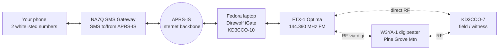
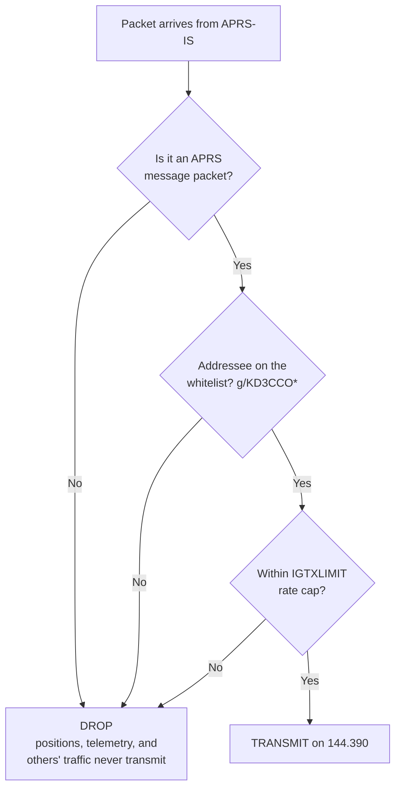
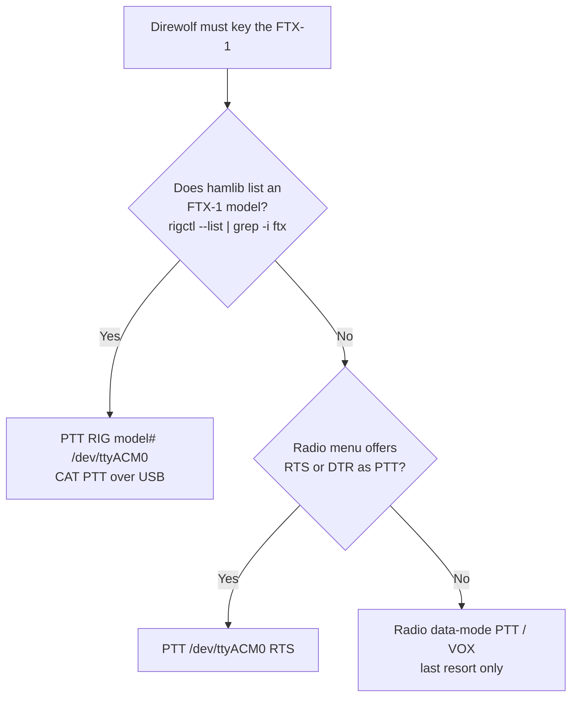
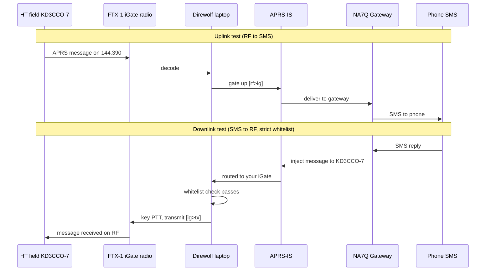

# Bidirectional APRS iGate: Bench Prototype

**Strict Internet-to-RF whitelist, KD3CCO**
Prototype platform: Fedora laptop + Yaesu FTX-1 Optima (USB-C)

---

## 1. Objective

Stand up a working two-way APRS iGate on prototype hardware and prove three things before committing to the permanent Raspberry Pi + TM-V71A build:

1. **Uplink (RF to Internet):** packets heard on 144.390 are gated to APRS-IS. **Confirmed working:** a message sent from RF to the `SMS` gateway reaches the cell phone, so this leg is proven end to end.
2. **Downlink (Internet to RF):** messages arriving from APRS-IS are transmitted on RF, so an SMS reply reaches a field station. This is the leg still to close, because the nearby igate that hears you best (W3SWL-2) is receive-only (`qAO`) and can never deliver a reply back to you.
3. **Strict whitelist:** the only thing ever keyed onto the air is an APRS *message* addressed to your own callsign, or another call on your whitelist. Everything else (positions, telemetry, messages to anyone else) is silently dropped.

This is a bench rig, so the document errs toward low power, a nearby witness receiver, and validating each leg in isolation before going for the full loop.

---

## 2. Equipment

| Role | Item | Notes |
|------|------|-------|
| iGate host | Fedora laptop | Runs Direwolf + hamlib |
| iGate radio | Yaesu FTX-1 Optima | HF/50/70/144/430, one USB-C cable carries CAT + TX control + audio codec |
| Field / witness station | Any 2 m radio (HT is fine) as KD3CCO-7 | Originates the uplink test and receives the downlink test |
| Internet | Home network | APRS-IS reachable outbound on TCP 14580 |
| SMS bridge | NA7Q SMS gateway | Already confirmed working for your call |

Two points about the FTX-1 Optima that shape everything below:

- It exposes **CAT, transmit control, and an audio codec over the single USB connection**, so you do not need an external sound-card interface. Direwolf talks to the built-in codec for audio and keys the radio over USB.
- It has an **internal 1200/9600 APRS TNC**, but you are *not* using it here. Direwolf is the modem. Operate the radio as plain **FM with data audio routed to USB**, and leave the internal APRS/decode function off so the two do not fight over the same audio.

---

## 3. System Architecture



Every link is bidirectional. On the bench you will lean on the **direct RF** path between the FTX-1 and a nearby witness radio; the **digi** path (W3YA-1) is what carries the real over-the-air downlink to a distant field station once the bench test passes.

---

## 4. How the Strict Whitelist Works

The rule is one line: a *message* addressed to a whitelisted call gets transmitted, and nothing else does.



The whole thing is one config line, `FILTER IG 0 g/KD3CCO*`. Two properties make it strict *and* simple:

- **It is addressee-only, and only messages have an addressee.** Positions, telemetry, and status are broadcasts with no recipient, so they can never match and can never be transmitted. You do not have to enumerate packet types to exclude them.
- **It removes the heard-recently dependency.** Specifying your own IS-to-RF filter replaces Direwolf's default "messages only to stations heard nearby recently" behavior. So a message to a whitelisted call transmits **unconditionally**, subject only to the rate cap. No hop-count reasoning, no `LOC_CNT` dependence. That is exactly the return leg that was missing when your `{26` and `{31` messages kept retrying unacked.

Add more calls by chaining with slashes: `g/KD3CCO*/W3XYZ*`. The wildcard covers all SSIDs of each call.

One trap to avoid: APRS filter tokens are **OR'd**, not AND'd. Adding a source token like `b/NA7Q*` would *widen* the gate (pass anything from that source too), not narrow it. Keep the single `g/` addressee filter, and enforce the "only two phone numbers" rule where it belongs, at the NA7Q gateway registration.

---

## 5. Software Install (Fedora)

```bash
sudo dnf install direwolf hamlib alsa-utils
```

Confirm Direwolf was built with hamlib (needed for CAT PTT):

```bash
direwolf -h 2>&1 | grep -i hamlib   # or: ldd $(which direwolf) | grep -i hamlib
```

Identify the FTX-1's audio codec and serial port after plugging in the USB-C cable:

```bash
arecord -l                # look for "USB Audio CODEC"; note the card number
dmesg | tail -20          # look for the new tty (often /dev/ttyACM0 or /dev/ttyUSB0)
ls /dev/ttyACM* /dev/ttyUSB* 2>/dev/null
```

Add yourself to the `dialout` group so Direwolf can open the serial port without root, then log out and back in:

```bash
sudo usermod -aG dialout $USER
```

---

## 6. Radio Setup (FTX-1 Optima)

Exact menu labels on this radio are new, so treat these as the settings to locate rather than fixed paths:

1. Band/frequency: **144.390 MHz**, mode **FM** (data/packet FM if offered).
2. Route **TX and RX audio to the USB codec** (the data-in / data-out source set to USB), so Direwolf sends and receives through the USB connection rather than the mic/speaker jacks.
3. Set the radio's **PTT source** to match whichever PTT method you pick in Section 7 (CAT/USB PTT is cleanest).
4. **Disable the internal APRS/TNC decode** so it does not contend with Direwolf for the audio.
5. Start at **low power** (QRP, a few watts) for bench work, ideally into a dummy load or a short antenna, and only raise power once decode and gating are confirmed.

---

## 7. Direwolf Configuration

Save as `~/direwolf.conf`. Replace the three placeholders (card number, PTT model, passcode).

```ini
ACHANNELS 1
ADEVICE  plughw:2,0        # your card # from `arecord -l`

CHANNEL 0
MYCALL   KD3CCO-10
MODEM    1200

PTT RIG XXXX /dev/ttyACM0  # model # from `rigctl --list` (see Section 8)

IGSERVER noam.aprs2.net
IGLOGIN  KD3CCO 123456     # your passcode

FILTER   IG 0 g/KD3CCO*    # web -> RF: ONLY messages to whitelisted calls
IGTXVIA  0                 # bench: direct. Field: IGTXVIA 0 WIDE2-1 (W3YA-1)
IGTXLIMIT 6 10
```

That is the entire gateway. The `FILTER IG 0` line is the only thing between the Internet and your transmitter, so it is the one line to get right; whitelist more calls by chaining, `g/KD3CCO*/W3XYZ*`.

Two intentional omissions for brevity: presence beacons (`PBEACON`/`IBEACON`) and the optional server-side `IGFILTER g/KD3CCO*` prefilter. Neither changes what transmits. The server-side filter only trims inbound bandwidth; add it back if you want a quieter feed. On the path line, `IGTXVIA 0` transmits direct for bench work, and `IGTXVIA 0 WIDE2-1` is the field path, since your testing showed W3YA-1 on Pine Grove Mountain answers WIDE2, not WIDE1.

---

## 8. PTT Ladder

PTT is the single most fiddly part on a radio this new, because hamlib may or may not yet ship a dedicated FTX-1 model. Work down this ladder:



Quick CAT test before trusting Direwolf, once you have a model number and port:

```bash
rigctl -m XXXX -r /dev/ttyACM0 T 1   # key TX
rigctl -m XXXX -r /dev/ttyACM0 T 0   # unkey
```

If the radio keys and unkeys cleanly, CAT PTT is your method.

---

## 9. Bench Test Procedure

Run Direwolf in a terminal so you can watch the tag lines:

```bash
direwolf -c ~/direwolf.conf
```

The three tag lines to watch for are `[rf>ig]` (something you heard went up to the Internet), `[ig>rf]` or `[ig>tx]` (something from the Internet was transmitted), and the periodic `IGATE` statistics line that reports `LOC_CNT`.



**Test A, decode only.** With the HT, send a beacon or message on 144.390. Confirm Direwolf prints the decoded frame. If nothing decodes, fix RX audio level before anything else.

**Test B, uplink gating.** Confirm the decoded frame produces an `[rf>ig]` line, then check your iGate and KD3CCO-7 appear on aprs.fi. This proves RF to Internet.

**Test C, PTT.** Trigger a transmit (Test D will do it naturally, or use the `rigctl` keying test). Confirm the FTX-1 actually keys and the witness radio hears carrier.

**Test D, downlink with the whitelist.** From one of your registered phone numbers, text the NA7Q gateway a message to KD3CCO-7. Watch for the `[ig>tx]` line and confirm the witness radio receives the message. This proves Internet to RF.

**Test E, strictness (the important negative test).** Arrange or wait for an APRS message addressed to *someone else*, or send yourself a position rather than a message. Confirm Direwolf **does not** transmit it. Passing the negative test is what tells you the whitelist is real and not just permissive-by-luck.

---

## 10. Success Criteria

- [ ] Frames from KD3CCO-7 decode in the Direwolf console.
- [ ] `[rf>ig]` appears and both stations show on aprs.fi. (The full RF-to-SMS path is already confirmed over the air; this just verifies the bench igate does the gating.)
- [ ] The FTX-1 keys under Direwolf control.
- [ ] An SMS to your call comes back out on RF (`[ig>tx]`) and is received. **This is the leg you are here to close.**
- [ ] A non-message, or a message to a non-whitelisted call, is **not** transmitted.

When these hold, the prototype has proven the full bidirectional design with a strict downlink whitelist. Note that with the explicit `FILTER IG 0` in place, delivery no longer depends on `LOC_CNT` or heard-recently state, so it is informational only.

---

## 11. Operating Notes and Cautions

- **Keep bench power low and prefer a dummy load.** A software TNC under test can key unexpectedly while you tune settings; low power and a load protect the band and the radio's finals.
- **Acknowledgments ride the same rails.** When the witness radio receives the message it emits an ack addressed to the gateway; your iGate gates that up automatically, and gateway retries to your call come back down through the same whitelist. No extra config.
- **The two-number limit is not in this file.** It lives at the NA7Q registration. Direwolf only reasons about callsigns.
- **Watch out for double audio paths.** If the FTX-1's internal TNC is left enabled, you can get odd decodes or self-triggered transmits. Confirm it is off.

---

## 12. From Prototype to Production

Once the six criteria pass, the same `direwolf.conf` moves almost verbatim to the permanent build. The differences to expect:

- Swap the Fedora laptop for the Raspberry Pi and the FTX-1 Optima for the Kenwood TM-V71A. The `ADEVICE` and `PTT` lines change to match the Pi's sound-card interface and the TM-V71A's data connector; everything from `IGSERVER` down stays the same.
- Uncomment `IGTXVIA 0 WIDE2-1` as the standing transmit path, since production downlink always goes out through W3YA-1 to reach you in the field.
- Consider a fixed, deliberately rounded beacon position for the permanent site, and wrap Direwolf in a `systemd` service so it restarts on boot.
