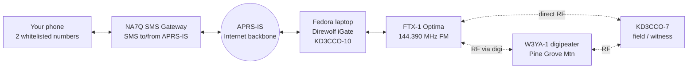
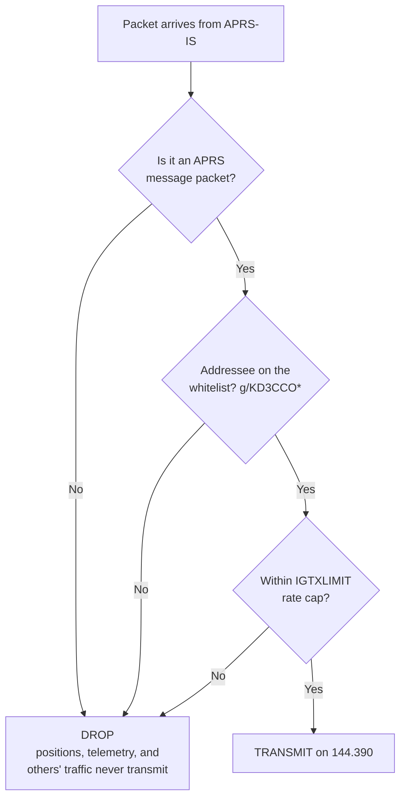
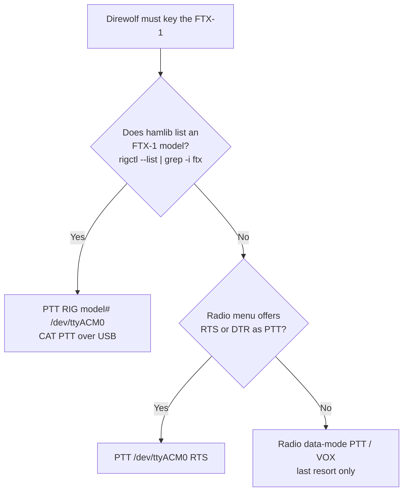

# Bidirectional APRS iGate: Bench Prototype

**Strict Internet-to-RF whitelist, KD3CCO**
Prototype platform: Fedora laptop + Yaesu FTX-1 Optima (USB-C)

---

## Contents

- [1. Objective](#1-objective)
- [2. Equipment](#2-equipment)
- [3. System Architecture](#3-system-architecture)
- [4. How the Strict Whitelist Works](#4-how-the-strict-whitelist-works)
- [5. Software Install (Fedora)](#5-software-install-fedora)
- [6. Radio Setup (FTX-1 Optima)](#6-radio-setup-ftx-1-optima)
- [7. Direwolf Configuration](#7-direwolf-configuration)
- [8. PTT Ladder](#8-ptt-ladder)
- [9. Bench Test Procedure](#9-bench-test-procedure)
- [10. Success Criteria](#10-success-criteria)
- [11. Operating Notes and Cautions](#11-operating-notes-and-cautions)
- [12. From Prototype to Production](#12-from-prototype-to-production)
- [13. Implementation](#13-implementation)
  - [13.1 Radio requirements](#131-radio-requirements)
  - [13.2 CAT and PTT](#132-cat-and-ptt)
  - [13.3 APRS-IS gating configuration](#133-aprs-is-gating-configuration)
  - [13.4 Container security model](#134-container-security-model)
  - [13.5 Operational tooling](#135-operational-tooling)
- [14. Operating constraints](#14-operating-constraints)
  - [14.1 Log tags do not mean what they appear to](#141-log-tags-do-not-mean-what-they-appear-to)
  - [14.2 Uplink logging requires `-d i`](#142-uplink-logging-requires--d-i)
  - [14.3 RF coupling into USB](#143-rf-coupling-into-usb)
  - [14.4 Container filesystem constraints](#144-container-filesystem-constraints)
- [15. Limitations and future work](#15-limitations-and-future-work)
  - [15.1 Verified behaviour](#151-verified-behaviour)

---

## 1. Objective

Stand up a working two-way APRS iGate on prototype hardware and prove three things before committing to a permanent build:

1. **Uplink (RF to Internet):** packets heard on 144.390 are gated to APRS-IS. **Confirmed working:** a message sent from RF to the `SMS` gateway reaches the cell phone, so this leg is proven end to end.
2. **Downlink (Internet to RF):** messages arriving from APRS-IS are transmitted on RF, so an SMS reply reaches a field station. This is the leg still to close. Nearby iGates that hear this station may be receive-only (`qAO`), and a receive-only gate can never deliver a reply back to RF.
3. **Strict whitelist:** the only thing ever keyed onto the air is an APRS *message* addressed to this station's own callsign, or another call on the whitelist. Everything else (positions, telemetry, messages to anyone else) is silently dropped.

This is a bench rig, so the document errs toward low power, a nearby witness receiver, and validating each leg in isolation before going for the full loop.

---

## 2. Equipment

| Role | Item | Notes |
|------|------|-------|
| iGate host | Fedora laptop | Runs Direwolf + hamlib |
| iGate radio | Yaesu FTX-1 Optima | HF/50/70/144/430, one USB-C cable carries CAT + TX control + audio codec |
| Field / witness station | Any 2 m radio (HT is fine) as KD3CCO-7 | Originates the uplink test and receives the downlink test |
| Internet | Home network | APRS-IS reachable outbound on TCP 14580 |
| SMS bridge | NA7Q SMS gateway | Registered for this station's call |

Two points about the FTX-1 Optima that shape everything below:

- It exposes **CAT, transmit control, and an audio codec over the single USB connection**, so no external sound-card interface is required. Direwolf talks to the built-in codec for audio and keys the radio over USB.
- It has an **internal 1200/9600 APRS TNC**, but it is *not* used here. Direwolf is the modem. Operate the radio as plain **FM with data audio routed to USB**, and leave the internal APRS/decode function off so the two do not fight over the same audio.

---

## 3. System Architecture



Every link is bidirectional. Bench testing uses the **direct RF** path between the FTX-1 and a nearby witness radio; the **digi** path (W3YA-1) is what carries the real over-the-air downlink to a distant field station once the bench test passes.

---

## 4. How the Strict Whitelist Works

The rule is one line: a *message* addressed to a whitelisted call gets transmitted, and nothing else does.



The whole thing is one config line, `FILTER IG 0 g/KD3CCO*`. Two properties make it strict *and* simple:

- **It is addressee-only, and only messages have an addressee.** Positions, telemetry, and status are broadcasts with no recipient, so they can never match and can never be transmitted. You do not have to enumerate packet types to exclude them.
- **It removes the heard-recently dependency.** Specifying an explicit IS-to-RF filter replaces Direwolf's default "messages only to stations heard nearby recently" behavior. So a message to a whitelisted call transmits **unconditionally**, subject only to the rate cap. No hop-count reasoning, no `LOC_CNT` dependence. That is the return leg that is missing when messages retry unacked.

Add more calls by chaining with slashes: `g/KD3CCO*/W3XYZ*`. The wildcard covers all SSIDs of each call.

One trap to avoid: APRS filter tokens are **OR'd**, not AND'd. Adding a source token like `b/NA7Q*` would *widen* the gate (pass anything from that source too), not narrow it. Keep the single `g/` addressee filter, and enforce the "only two phone numbers" rule where it belongs, at the NA7Q gateway registration.

---

## 5. Software Install (Fedora)

```bash
sudo dnf install direwolf hamlib alsa-utils
```

Confirm Direwolf was built with hamlib (needed for CAT PTT):

```bash
direwolf -h 2>&1 | grep -i hamlib   # or: ldd $(which direwolf) | grep -i hamlib
```

Identify the FTX-1's audio codec and serial port after plugging in the USB-C cable:

```bash
arecord -l                # look for "USB Audio CODEC"; note the card number
dmesg | tail -20          # look for the new tty (often /dev/ttyACM0 or /dev/ttyUSB0)
ls /dev/ttyACM* /dev/ttyUSB* 2>/dev/null
```

Add yourself to the `dialout` group so Direwolf can open the serial port without root, then log out and back in:

```bash
sudo usermod -aG dialout $USER
```

---

## 6. Radio Setup (FTX-1 Optima)

Exact menu labels on this radio are new, so treat these as the settings to locate rather than fixed paths:

1. Band/frequency: **144.390 MHz**, mode **D-FM (data FM)**.
   > **Caution.** Data FM is required, not a preference. In plain FM the FTX-1
   > modulates from the microphone input rather than the USB codec: the radio
   > keys and transmits a carrier containing no data, while PTT, SWR, frequency
   > and audio levels all test correct, so the fault is easy to misattribute.
   > `deploy_igate.sh` sets the mode over CAT on every start and warns if the
   > radio reports plain FM. See §13.1.
2. Route **TX and RX audio to the USB codec** (the data-in / data-out source set to USB), so Direwolf sends and receives through the USB connection rather than the mic/speaker jacks.
3. Set the radio's **PTT source** to match the PTT method selected in Section 7 (CAT/USB PTT is cleanest).
4. **Disable the internal APRS/TNC decode** so it does not contend with Direwolf for the audio.
5. Start at **low power** (QRP, a few watts) for bench work, ideally into a dummy load or a short antenna, and only raise power once decode and gating are confirmed.

---

## 7. Direwolf Configuration

`deploy_igate.sh` generates this file from `igate.conf` on every start (§13); it
is shown here to document what the gateway actually requires. Substitute the
audio card number, hamlib rig model and passcode for the station.

```ini
ACHANNELS 1
ADEVICE  plughw:1,0          # card # from `arecord -l`

CHANNEL 0
MYCALL   KD3CCO-10
MODEM    1200

# CAT and PTT are on separate ports on this radio, which a single-port
# "PTT RIG model port" directive cannot express, so rigctld bridges them
# and Direwolf addresses it as a network rig. See §13.2.
PTT RIG 2 localhost:4532

IGSERVER noam.aprs2.net
IGLOGIN  KD3CCO 123456       # APRS-IS passcode

IGFILTER  g/KD3CCO*          # what the server SENDS to this station
FILTER    IG 0 g/KD3CCO*     # what this station may TRANSMIT
IGMSP     0                  # no courtesy position reports
IGTXVIA   0                  # bench: direct. Field: 0 WIDE2-1
IGTXLIMIT 6 10
```

Three of these lines carry the whitelist guarantee, and all three are needed:

- **`FILTER IG 0`** is the whitelist proper — the only thing between the
  Internet and the transmitter. Chain additional calls with slashes:
  `g/KD3CCO*/W3XYZ*`.
- **`IGFILTER`** is the server-side subscription. It governs what APRS-IS
  *sends*, where `FILTER IG 0` governs what may be *transmitted*. Without it the
  server forwards only traffic involving stations heard recently on RF, which on
  a newly started iGate is nothing at all, and the downlink never fires.
- **`IGMSP 0`** disables Direwolf's courtesy position report, which otherwise
  transmits a position from any message sender regardless of other filtering.

Presence beacons (`PBEACON`/`IBEACON`) are omitted deliberately. On the path
line, `IGTXVIA 0` transmits direct for bench work and `IGTXVIA 0 WIDE2-1` is the
field path; `WIDE1-1` is also answered locally.

---

## 8. PTT Ladder

PTT is the single most fiddly part on a radio this new, because hamlib may or may not yet ship a dedicated FTX-1 model. Work down this ladder:



Quick CAT test before trusting Direwolf, once a model number and port are known:

```bash
rigctl -m XXXX -r /dev/ttyACM0 T 1   # key TX
rigctl -m XXXX -r /dev/ttyACM0 T 0   # unkey
```

If the radio keys and unkeys cleanly, CAT PTT is the method to use.

---

## 9. Bench Test Procedure

Run Direwolf in a terminal to watch the tag lines:

```bash
direwolf -c ~/direwolf.conf
```

The three tag lines to watch for are `[rx>ig]` (a received frame went up to the Internet), `[ig>rf]` or `[ig>tx]` (something from the Internet was transmitted), and the periodic `IGATE` statistics line that reports `LOC_CNT`.


**Test A, decode only.** With the HT, send a beacon or message on 144.390. Confirm Direwolf prints the decoded frame. If nothing decodes, fix RX audio level before anything else.

**Test B, uplink gating.** Confirm the decoded frame produces an `[rx>ig]` line, then check that this iGate and KD3CCO-7 appear on aprs.fi. This proves RF to Internet.

**Test C, PTT.** Trigger a transmit (Test D will do it naturally, or use the `rigctl` keying test). Confirm the FTX-1 actually keys and the witness radio hears carrier.

**Test D, downlink with the whitelist.** From a registered phone number, text the SMS gateway a message to KD3CCO-7. Watch for the `[ig>tx]` line and confirm the witness radio receives the message. This proves Internet to RF.

**Test E, strictness (the important negative test).** Arrange or wait for an APRS message addressed to *someone else*, or send a position rather than a message. Confirm Direwolf **does not** transmit it. Passing the negative test is what establishes that the whitelist is real and not permissive by luck.

---

## 10. Success Criteria

- [ ] Frames from KD3CCO-7 decode in the Direwolf console.
- [ ] `[rx>ig]` appears and both stations show on aprs.fi. (The full RF-to-SMS path is already confirmed over the air; this just verifies the bench igate does the gating.)
- [ ] The FTX-1 keys under Direwolf control.
- [ ] An SMS to this station's call comes back out on RF (`[0L]`, or `IS GATED`
      under `deploy_igate.sh monitor`) and is received. **This is the leg this
      prototype exists to close.** Note that `[ig>tx]` does *not* indicate
      transmission; see §14.1.
- [ ] A non-message, or a message to a non-whitelisted call, is **not** transmitted.

When these hold, the prototype has proven the full bidirectional design with a strict downlink whitelist. Note that with the explicit `FILTER IG 0` in place, delivery no longer depends on `LOC_CNT` or heard-recently state, so it is informational only.

---

## 11. Operating Notes and Cautions

- **Keep bench power low and prefer a dummy load.** A software TNC under test can key unexpectedly while settings are being tuned; low power and a load protect the band and the radio's finals.
- **Acknowledgments ride the same rails.** When the witness radio receives the message it emits an ack addressed to the gateway; the iGate gates that up automatically, and gateway retries come back down through the same whitelist. No extra config.
- **The two-number limit is not in this file.** It lives at the NA7Q registration. Direwolf only reasons about callsigns.
- **Watch out for double audio paths.** If the FTX-1's internal TNC is left enabled, odd decodes or self-triggered transmits can result. Confirm it is off.

---

## 12. From Prototype to Production

Once the criteria pass, the configuration moves to a permanent build largely
unchanged. Host and radio for that build are not yet decided. The differences to
expect:

- `ADEVICE`, `CAT_DEVICE` and `PTT_DEVICE` change to match the chosen host's
  audio interface and the chosen radio's data connector. `RIG_MODEL` changes to
  that radio's hamlib model. Everything from `IGSERVER` down is unaffected.
- Whichever radio is chosen, confirm it has a data/packet mode that routes
  transmit audio from the host interface rather than the microphone input
  (§13.1), and check whether it presents CAT and PTT on one port or two
  (§13.2).
- Uncomment `IGTXVIA 0 WIDE2-1` as the standing transmit path, since production downlink goes out via a digipeater to reach a distant field station.
- Consider a fixed, deliberately rounded beacon position for the permanent site, and wrap Direwolf in a `systemd` service so it restarts on boot.

---

## 13. Implementation

The design in sections 1–12 is implemented as a containerised, config-driven
deployment rather than a hand-edited `direwolf.conf`.

| File | Purpose |
|------|---------|
| `igate.conf` | The only file edited by the operator. Plain `key = value`. |
| `igate.secrets` | APRS-IS passcode. Gitignored. |
| `deploy_igate.sh` | Single entry point: `config`, `build`, `up`, `down`, `restart`, `status`, `logs`, `monitor`, `uninstall`. |
| `Dockerfile`, `entrypoint.sh` | Container image and process startup. |
| `run/` | Generated at runtime: rendered `direwolf.conf`, status page, logs. Gitignored. |

`direwolf.conf` is a build artefact, regenerated from `igate.conf` on every
start and never edited directly.

### 13.1 Radio requirements

Three radio-side settings are mandatory. Each fails silently — the station
appears to transmit normally while emitting nothing decodable — so
`deploy_igate.sh up` asserts all three rather than trusting operator memory.

**Mode must be D-FM (data FM), not plain FM.** In plain FM the FTX-1 modulates
from the microphone input rather than the USB codec. Direwolf keys the radio and
transmits a carrier containing no data. PTT, SWR, frequency and audio levels all
test correct, and no receiver can decode the result. `up` sets the mode over CAT
and warns if the radio reports plain `FM`.

`rigctl` mode names: `M FM` selects `FM`; `M PKTFM` selects `FM-D`.

**Audio levels must be set explicitly.** The ALSA mixer defaults are wrong in
both directions:

| | Default | Required | Failure if wrong |
|---|---|---|---|
| TX playback | 23/37 | **10** | Over-deviation; signal audible but undecodable |
| RX capture | 1/35 | **35** | Too weak to decode |
| AGC | on | **off** | Unstable levels |

These reset to defaults whenever the radio's USB re-enumerates, so `up`
re-applies them on every start.

**Frequency** is set over CAT to `RADIO_FREQ` (144.390 MHz).

`up` also refuses to start if the ALSA card named by `ADEVICE` is absent, since
PTT would otherwise still key the radio and transmit an unmodulated carrier.

### 13.2 CAT and PTT

The FTX-1 exposes CAT control and PTT on two separate serial ports:

| Function | Device | Notes |
|---|---|---|
| CAT | `/dev/ttyUSB0` | 38400 baud |
| PTT | `/dev/ttyACM0` | keyed by CAT command (`RIG` in hamlib terms) |

Hamlib has no native FTX-1 model; the radio CAT-controls correctly as a Yaesu
FT-991, `rigctl` model **1035**.

Direwolf's `PTT RIG model port` directive accepts a single port and therefore
cannot drive this arrangement. `rigctld` bridges the two:

```
rigctld -m 1035 -r /dev/ttyUSB0 -s 38400 -p /dev/ttyACM0 -P RIG -t 4532 -T 127.0.0.1
```

Direwolf addresses it as a network rig with `PTT RIG 2 localhost:4532`.
`entrypoint.sh` starts `rigctld` bound to loopback, waits for it to accept
connections, then `exec`s Direwolf so Direwolf becomes PID 1 and receives
`docker stop` directly.

Radios with a single CAT/PTT port need only `PTT_DEVICE` set equal to
`CAT_DEVICE`; the same path applies.

### 13.3 APRS-IS gating configuration

Three directives govern gating, beyond those in section 7:

**`IGFILTER g/<calls>`** — the server-side subscription. Without it APRS-IS
sends only traffic involving stations heard recently on RF, which on a newly
started iGate is nothing, and the downlink never fires. `FILTER IG 0` governs
what may be *transmitted*; `IGFILTER` governs what the server *sends*. Both are
required.

**`FILTER IG 0 g/<calls>`** — the whitelist proper, as described in section 4.

**`IGMSP 0`** — disables Direwolf's "message sender position" feature, which
transmits a position report from any message sender *regardless of other
filtering rules*. Left enabled, it bypasses the whitelist. Required for the
strict-whitelist guarantee this design depends on.

### 13.4 Container security model

The gateway connects to the internet and keys a transmitter, so the container is
constrained to the minimum that functions. Each control below is verified
against the running container via `docker inspect`, `/proc/1/status`, and write
tests, rather than inferred from the flags passed.

**Privileges**

| Control | Setting | Verified as |
|---|---|---|
| Capabilities | `--cap-drop=ALL` | `CapEff` and `CapBnd` both zero — none held, none obtainable |
| Escalation | `no-new-privileges:true` | `NoNewPrivs: 1` |
| Syscalls | Docker default seccomp | `Seccomp: 2`, one filter loaded |
| User | `--user $(id -u):$(id -g)` | invoking user, never root |
| Privileged | not used | `Privileged: false` |

The container runs as the invoking user rather than the image's `igate` account
because the rendered `direwolf.conf` is mode 600 and contains the APRS-IS
passcode: the process must share the owner's UID to read it while the file stays
unreadable to other host users. For the same reason the config is mounted at
`/etc/direwolf/` rather than under `/home/igate`, which is mode 700 and owned by
a different UID.

**Filesystem** — `--read-only` root with a single `--tmpfs /tmp`. Writes to `/`,
`/etc`, `/usr`, `/home` and `/var` are rejected; only `/tmp` accepts them and is
discarded on removal. The rendered `direwolf.conf` is the sole bind mount, and
is mounted read-only.

**Devices** — only this radio's nodes, each `rw` (no `mknod`):

```
/dev/ttyUSB0        CAT control
/dev/ttyACM0        PTT
/dev/snd/controlC1  the radio's ALSA card
/dev/snd/pcmC1D0c   capture
/dev/snd/pcmC1D0p   playback
/dev/snd/timer      ALSA scheduling
```

Passing the whole `/dev/snd` directory is the common recipe and is too broad: it
also grants `controlC0` and `pcmC0D0c`, the host's built-in microphone.
`deploy_igate.sh` derives the card number from `ADEVICE` and passes only that
card's nodes, falling back to the full directory with a warning only if
`ADEVICE` names a card non-numerically.

Device access works without root because the container is launched with
`--group-add` for the host's `dialout` and `audio` GIDs.

**Resources** — `--pids-limit=64`, `--memory=512m`.

**Network** — no published ports. `rigctld` binds `127.0.0.1` inside the
container, reachable by Direwolf in the same namespace and nothing else.

Egress is restricted rather than left to the default bridge, which permits
unrestricted outbound access. The container is placed on a dedicated docker
network (`aprs-igate-net`, `172.28.7.0/29`) and filtered in the iptables
`DOCKER-USER` chain, which Docker evaluates before its own forwarding rules:

| Rule | Purpose |
|---|---|
| `ESTABLISHED,RELATED` → RETURN | replies to connections the container opened |
| `tcp/53`, `udp/53` → RETURN | DNS resolution of the APRS-IS hostname |
| `tcp/14580` → RETURN | the APRS-IS connection itself |
| all else from subnet → DROP | everything not required |

Filtering by port rather than address is deliberate: APRS-IS is a rotating pool
reached through round-robin DNS, so pinning addresses would break on rotation.

This requires root. If `sudo` is unavailable non-interactively, `up` reports
that egress is unrestricted and continues rather than refusing to start — a
gateway that runs with looser networking is preferable to one that will not
start at all. Set `RESTRICT_EGRESS = no` to skip it deliberately.

**Scope** — this constrains a compromised process. It does not constrain the
radio: anything able to inject into Direwolf's KISS port inside the container
can key the transmitter. The whitelist and `IGTXLIMIT` bound that, and the
radio's time-out timer is the only backstop if the control path itself fails
(§14.3).

### 13.5 Operational tooling

`deploy_igate.sh monitor` annotates Direwolf's output into packet flow:

| Label | Meaning |
|---|---|
| `RF RX` | Heard on the air and decoded |
| `RF->IS UP` | Gated up to APRS-IS by this station |
| `IS GATED` | From APRS-IS, matched the whitelist, transmitted |
| `IS DROP` | From APRS-IS, did not match, dropped |
| `TX LOCAL` | Transmitted by this station |

Direwolf's decode of each frame is shown indented beneath it; `monitor raw`
suppresses that.

`status` reports state and writes `run/status.html`, a static page showing the
whitelist and resolved filter.

Direwolf echoes its APRS-IS login line, which contains the passcode in clear
text. `monitor` redacts it. The raw `logs` output does not, so prefer `monitor`
when sharing terminal output or screenshots.

---

## 14. Operating constraints

Behaviours of Direwolf, the radio and the host that this design must account
for. Each fails silently: nothing reports an error when they are wrong, so each
is worth knowing before diagnosing a fault.

### 14.1 Log tags do not mean what they appear to

`[ig>tx]` is printed when a packet **arrives from APRS-IS**, before the
whitelist is evaluated (`igate.c:1837`; the filter runs at `igate.c:2261`). It
does not indicate transmission. The tag indicating an actual transmission is
**`[0L]`**.

Reading `[ig>tx]` as "transmitted" makes a correctly functioning whitelist
appear to be leaking. An `[ig>tx]` with no following `[0L]` was dropped.

A filter that fails to parse also fails **closed**: `pfilter()` returns `-1` and
`igate.c` drops anything that is not exactly `1`. A malformed filter therefore
suppresses all downlink traffic rather than passing it.

`deploy_igate.sh monitor` pairs the two tags and reports the real outcome.

### 14.2 Uplink logging requires `-d i`

Direwolf prints `[rx>ig]` for RF-to-APRS-IS gating only when the iGate debug
level is at least 1 (`igate.c:1604`, set from `d_i_opt` at `direwolf.c:1129`).
Without it the uplink direction produces no log output at all and cannot be
distinguished from a failure.

The flag is `-d i`. `-d g` is the unrelated GPS debug option
(`direwolf.c:222`). `entrypoint.sh` passes `-d i`.

Confirmation of which station gated a packet is also available externally: the
`qAR`/`qAO` construct in the path on APRS-IS names the gating station.

### 14.3 RF coupling into USB

At 5 W with a poorly matched antenna near the host, RF crashes the USB link.
Because PTT is asserted over that link, the unkey never arrives and the radio
remains in transmit. No software watchdog can address this: the control path is
what fails.

The root cause in testing was a quarter-wave whip with no ground plane, which is
poorly matched and radiates into the shack. A half-wave on an NMO mount reads
under 1.2:1 to 5 W and resolves it. A ferrite choke on the USB cable and
physical separation reduce the symptom.

The only reliable backstop is the **radio's own time-out timer**, which operates
independently of the failed control path. Set to 3 minutes here. On the FTX-1
this setting is global, applying to voice as well as data.

### 14.4 Container filesystem constraints

A read-only root filesystem cannot accept a bind mount into a directory the
container user cannot traverse. `/home/igate` in the image is mode 700 owned by
the image's own user, so the rendered config is mounted at `/etc/direwolf/`
(mode 755) instead.

Under `docker run -d` stdout is a pipe, so Direwolf's C stdio block-buffers and
`docker logs` appears inactive. `entrypoint.sh` wraps it in `stdbuf -oL -eL`.
`gawk` requires explicit `fflush()` for the same reason in `monitor`.

---

## 15. Limitations and future work

- **Outbound network is unrestricted.** The container may reach any host, not
  only APRS-IS. Plain Docker cannot express that constraint; it requires a
  custom network with firewall rules or an egress proxy. This is the largest
  remaining gap in the security model.
- **The base image is not pinned by digest.** `FROM fedora:43` floats. Pinning
  would make builds reproducible and resist a compromised upstream tag, at the
  cost of no longer receiving updates automatically.
- **The Docker daemon runs as root.** Inherent to Docker. Rootless Podman
  removes this and accepts the same `Dockerfile` and flags.
- **No custom seccomp profile.** The default blocks approximately 44 syscalls; a
  Direwolf-specific allowlist would be tighter but requires ongoing maintenance.
- **Bare-metal mode is untested.** `DEPLOY_MODE = bare-metal` is implemented but
  only docker mode has been exercised.
- **Audio levels are not self-calibrating.** The values in `igate.conf` were
  determined empirically for one radio at one power level. A calibration routine
  that transmits and checks for a digipeat would remove the manual step.
- **Mixer control names are assumed.** `apply_audio_levels` looks for
  `Speaker Playback Volume` and `Mic Capture Volume`; other codecs will differ.
  It warns rather than failing.
### 15.1 Verified behaviour

| Function | Evidence |
|----------|----------|
| RF → APRS-IS | Received frames appear on APRS-IS carrying this station's `qAR` construct |
| APRS-IS → RF | Gated messages transmit (`[0L]`) and are repeated by a digipeater |
| Message delivery | SMS-gateway messages display on the receiving radio and are acknowledged to the original sender; the acknowledgement is gated back to APRS-IS |
| Strict whitelist | Non-matching traffic produces `[ig>tx]` with no `[0L]` |
