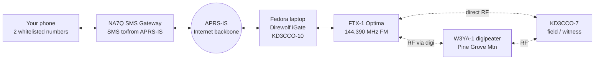
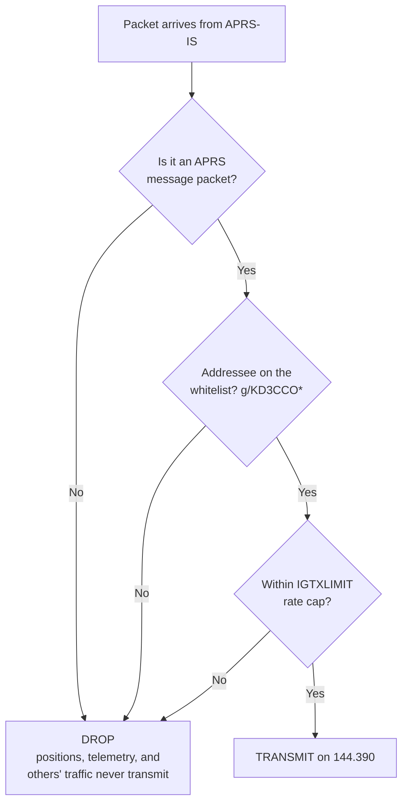
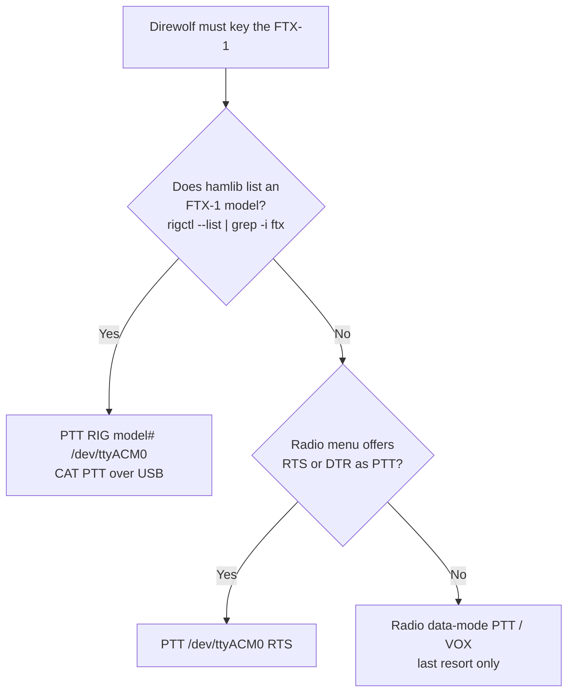

# Bidirectional APRS iGate: Bench Prototype

**Strict Internet-to-RF whitelist, KD3CCO**
Prototype platform: Fedora laptop + Yaesu FTX-1 Optima (USB-C)

---

## Contents

- [1. Objective](#1-objective)
- [2. Equipment](#2-equipment)
- [3. System Architecture](#3-system-architecture)
- [4. How the Strict Whitelist Works](#4-how-the-strict-whitelist-works)
- [5. Software Install (Fedora)](#5-software-install-fedora)
- [6. Radio Setup (FTX-1 Optima)](#6-radio-setup-ftx-1-optima)
- [7. Direwolf Configuration](#7-direwolf-configuration)
- [8. PTT Ladder](#8-ptt-ladder)
- [9. Bench Test Procedure](#9-bench-test-procedure)
- [10. Success Criteria](#10-success-criteria)
- [11. Operating Notes and Cautions](#11-operating-notes-and-cautions)
- [12. From Prototype to Production](#12-from-prototype-to-production)
- [13. Implementation](#13-implementation)
  - [13.1 Radio requirements](#131-radio-requirements)
  - [13.2 CAT and PTT](#132-cat-and-ptt)
  - [13.3 APRS-IS gating configuration](#133-aprs-is-gating-configuration)
  - [13.4 Container security model](#134-container-security-model)
  - [13.5 Operational tooling](#135-operational-tooling)
  - [13.6 Transmit path, receive filter, and beacon](#136-transmit-path-receive-filter-and-beacon)
  - [13.7 Read-only LAN web monitor](#137-read-only-lan-web-monitor)
- [14. Operating constraints](#14-operating-constraints)
  - [14.1 Log tags do not mean what they appear to](#141-log-tags-do-not-mean-what-they-appear-to)
  - [14.2 Uplink logging requires `-d i`](#142-uplink-logging-requires--d-i)
  - [14.3 RF coupling into USB](#143-rf-coupling-into-usb)
  - [14.4 Container filesystem constraints](#144-container-filesystem-constraints)
  - [14.5 `rigctl` prefixes its answer with rigctld's banner](#145-rigctl-prefixes-its-answer-with-rigctlds-banner)
  - [14.6 Gated and dropped packets do not alternate in the log](#146-gated-and-dropped-packets-do-not-alternate-in-the-log)
  - [14.7 Gating races with neighbouring iGates](#147-gating-races-with-neighbouring-igates)
- [15. Limitations and future work](#15-limitations-and-future-work)
  - [15.1 Verified behaviour](#151-verified-behaviour)
- [16. Headless Raspberry Pi deployment](#16-headless-raspberry-pi-deployment)
  - [16.1 Offline image customisation](#161-offline-image-customisation)
  - [16.2 Access without a console](#162-access-without-a-console)
  - [16.3 WiFi](#163-wifi)
  - [16.4 First boot and service startup](#164-first-boot-and-service-startup)
  - [16.5 Local control ports](#165-local-control-ports)
  - [16.6 Deployment mode and hardware constraints](#166-deployment-mode-and-hardware-constraints)
  - [16.7 Secrets on the card](#167-secrets-on-the-card)
  - [16.8 Surviving power removal](#168-surviving-power-removal)
  - [16.9 Writing the card](#169-writing-the-card)

---

## 1. Objective

Stand up a working two-way APRS iGate on prototype hardware and prove three things before committing to a permanent build:

1. **Uplink (RF to Internet):** packets heard on 144.390 are gated to APRS-IS. **Confirmed working:** a message sent from RF to the `SMS` gateway reaches the cell phone, so this leg is proven end to end.
2. **Downlink (Internet to RF):** messages arriving from APRS-IS are transmitted on RF, so an SMS reply reaches a field station. This is the leg still to close. Nearby iGates that hear this station may be receive-only (`qAO`), and a receive-only gate can never deliver a reply back to RF.
3. **Strict whitelist:** the only thing ever keyed onto the air is an APRS *message* addressed to this station's own callsign, or another call on the whitelist. Everything else (positions, telemetry, messages to anyone else) is silently dropped.

This is a bench rig, so the document errs toward low power, a nearby witness receiver, and validating each leg in isolation before going for the full loop.

---

## 2. Equipment

| Role | Item | Notes |
|------|------|-------|
| iGate host | Fedora laptop | Runs Direwolf + hamlib |
| iGate radio | Yaesu FTX-1 Optima | HF/50/70/144/430, one USB-C cable carries CAT + TX control + audio codec |
| Field / witness station | Any 2 m radio (HT is fine) as KD3CCO-7 | Originates the uplink test and receives the downlink test |
| Internet | Home network | APRS-IS reachable outbound on TCP 14580 |
| SMS bridge | NA7Q SMS gateway | Registered for this station's call |

Two points about the FTX-1 Optima that shape everything below:

- It exposes **CAT, transmit control, and an audio codec over the single USB connection**, so no external sound-card interface is required. Direwolf talks to the built-in codec for audio and keys the radio over USB.
- It has an **internal 1200/9600 APRS TNC**, but it is *not* used here. Direwolf is the modem. Operate the radio as plain **FM with data audio routed to USB**, and leave the internal APRS/decode function off so the two do not fight over the same audio.

---

## 3. System Architecture



Every link is bidirectional. Bench testing uses the **direct RF** path between the FTX-1 and a nearby witness radio; the **digi** path (W3YA-1) is what carries the real over-the-air downlink to a distant field station once the bench test passes.

---

## 4. How the Strict Whitelist Works

The rule is one line: a *message* addressed to a whitelisted call gets transmitted, and nothing else does.



The whole thing is one config line, `FILTER IG 0 g/KD3CCO*`. Two properties make it strict *and* simple:

- **It is addressee-only, and only messages have an addressee.** Positions, telemetry, and status are broadcasts with no recipient, so they can never match and can never be transmitted. You do not have to enumerate packet types to exclude them.
- **It removes the heard-recently dependency.** Specifying an explicit IS-to-RF filter replaces Direwolf's default "messages only to stations heard nearby recently" behavior. So a message to a whitelisted call transmits **unconditionally**, subject only to the rate cap. No hop-count reasoning, no `LOC_CNT` dependence. That is the return leg that is missing when messages retry unacked.

Add more calls by chaining with slashes: `g/KD3CCO*/W3XYZ*`. The wildcard covers all SSIDs of each call.

One trap to avoid: APRS filter tokens are **OR'd**, not AND'd. Adding a source token like `b/NA7Q*` would *widen* the gate (pass anything from that source too), not narrow it. Keep the single `g/` addressee filter, and enforce the "only two phone numbers" rule where it belongs, at the NA7Q gateway registration.

---

## 5. Software Install (Fedora)

```bash
sudo dnf install direwolf hamlib alsa-utils
```

Confirm Direwolf was built with hamlib (needed for CAT PTT):

```bash
direwolf -h 2>&1 | grep -i hamlib   # or: ldd $(which direwolf) | grep -i hamlib
```

Identify the FTX-1's audio codec and serial port after plugging in the USB-C cable:

```bash
arecord -l                # look for "USB Audio CODEC"; note the card number
dmesg | tail -20          # look for the new tty (often /dev/ttyACM0 or /dev/ttyUSB0)
ls /dev/ttyACM* /dev/ttyUSB* 2>/dev/null
```

Add yourself to the `dialout` group so Direwolf can open the serial port without root, then log out and back in:

```bash
sudo usermod -aG dialout $USER
```

---

## 6. Radio Setup (FTX-1 Optima)

Exact menu labels on this radio are new, so treat these as the settings to locate rather than fixed paths:

1. Band/frequency: **144.390 MHz**, mode **D-FM (data FM)**.
   > **Caution.** Data FM is required, not a preference. In plain FM the FTX-1
   > modulates from the microphone input rather than the USB codec: the radio
   > keys and transmits a carrier containing no data, while PTT, SWR, frequency
   > and audio levels all test correct, so the fault is easy to misattribute.
   > `deploy_igate.sh` sets the mode over CAT on every start and warns if the
   > radio reports plain FM. See §13.1.
2. Route **TX and RX audio to the USB codec** (the data-in / data-out source set to USB), so Direwolf sends and receives through the USB connection rather than the mic/speaker jacks.
3. Set the radio's **PTT source** to match the PTT method selected in Section 7 (CAT/USB PTT is cleanest).
4. **Disable the internal APRS/TNC decode** so it does not contend with Direwolf for the audio.
5. Start at **low power** (QRP, a few watts) for bench work, ideally into a dummy load or a short antenna, and only raise power once decode and gating are confirmed.

---

## 7. Direwolf Configuration

`deploy_igate.sh` generates this file from `igate.conf` on every start (§13); it
is shown here to document what the gateway actually requires. Substitute the
audio card number, hamlib rig model and passcode for the station.

```ini
ACHANNELS 1
ADEVICE  plughw:1,0          # card # from `arecord -l`

CHANNEL 0
MYCALL   KD3CCO-10
MODEM    1200

# CAT and PTT are on separate ports on this radio, which a single-port
# "PTT RIG model port" directive cannot express, so rigctld bridges them
# and Direwolf addresses it as a network rig. See §13.2.
PTT RIG 2 localhost:4532

IGSERVER noam.aprs2.net
IGLOGIN  KD3CCO 123456       # APRS-IS passcode

IGFILTER  g/KD3CCO*          # what the server SENDS to this station
FILTER    IG 0 g/KD3CCO*     # what this station may TRANSMIT
IGMSP     0                  # no courtesy position reports
IGTXVIA   0                  # digipeat path, or none; rendered from TX_VIA
IGTXLIMIT 6 10
```

Three of these lines carry the whitelist guarantee, and all three are needed:

- **`FILTER IG 0`** is the whitelist proper — the only thing between the
  Internet and the transmitter. Chain additional calls with slashes:
  `g/KD3CCO*/W3XYZ*`.
- **`IGFILTER`** is the server-side subscription. It governs what APRS-IS
  *sends*, where `FILTER IG 0` governs what may be *transmitted*. Without it the
  server forwards only traffic involving stations heard recently on RF, which on
  a newly started iGate is nothing at all, and the downlink never fires.
- **`IGMSP 0`** disables Direwolf's courtesy position report, which otherwise
  transmits a position from any message sender regardless of other filtering.

The transmit path and the presence beacon are both rendered from `igate.conf`
rather than written here; §13.6 covers them.

---

## 8. PTT Ladder

PTT is the single most fiddly part on a radio this new, because hamlib may or may not yet ship a dedicated FTX-1 model. Work down this ladder:



Quick CAT test before trusting Direwolf, once a model number and port are known:

```bash
rigctl -m XXXX -r /dev/ttyACM0 T 1   # key TX
rigctl -m XXXX -r /dev/ttyACM0 T 0   # unkey
```

If the radio keys and unkeys cleanly, CAT PTT is the method to use.

---

## 9. Bench Test Procedure

Run Direwolf in a terminal to watch the tag lines:

```bash
direwolf -c ~/direwolf.conf
```

The three tag lines to watch for are `[rx>ig]` (a received frame went up to the Internet), `[ig>rf]` or `[ig>tx]` (something from the Internet was transmitted), and the periodic `IGATE` statistics line that reports `LOC_CNT`.


**Test A, decode only.** With the HT, send a beacon or message on 144.390. Confirm Direwolf prints the decoded frame. If nothing decodes, fix RX audio level before anything else.

**Test B, uplink gating.** Confirm the decoded frame produces an `[rx>ig]` line, then check that this iGate and KD3CCO-7 appear on aprs.fi. This proves RF to Internet.

**Test C, PTT.** Trigger a transmit (Test D will do it naturally, or use the `rigctl` keying test). Confirm the FTX-1 actually keys and the witness radio hears carrier.

**Test D, downlink with the whitelist.** From a registered phone number, text the SMS gateway a message to KD3CCO-7. Watch for the `[ig>tx]` line and confirm the witness radio receives the message. This proves Internet to RF.

**Test E, strictness (the important negative test).** Arrange or wait for an APRS message addressed to *someone else*, or send a position rather than a message. Confirm Direwolf **does not** transmit it. Passing the negative test is what establishes that the whitelist is real and not permissive by luck.

---

## 10. Success Criteria

- [ ] Frames from KD3CCO-7 decode in the Direwolf console.
- [ ] `[rx>ig]` appears and both stations show on aprs.fi. (The full RF-to-SMS path is already confirmed over the air; this just verifies the bench igate does the gating.)
- [ ] The FTX-1 keys under Direwolf control.
- [ ] An SMS to this station's call comes back out on RF (`[0L]`, or `IS GATED`
      under `deploy_igate.sh monitor`) and is received. **This is the leg this
      prototype exists to close.** Note that `[ig>tx]` does *not* indicate
      transmission; see §14.1.
- [ ] A non-message, or a message to a non-whitelisted call, is **not** transmitted.

When these hold, the prototype has proven the full bidirectional design with a strict downlink whitelist. Note that with the explicit `FILTER IG 0` in place, delivery no longer depends on `LOC_CNT` or heard-recently state, so it is informational only.

---

## 11. Operating Notes and Cautions

- **Keep bench power low and prefer a dummy load.** A software TNC under test can key unexpectedly while settings are being tuned; low power and a load protect the band and the radio's finals.
- **Acknowledgments ride the same rails.** When the witness radio receives the message it emits an ack addressed to the gateway; the iGate gates that up automatically, and gateway retries come back down through the same whitelist. No extra config.
- **The two-number limit is not in this file.** It lives at the NA7Q registration. Direwolf only reasons about callsigns.
- **Watch out for double audio paths.** If the FTX-1's internal TNC is left enabled, odd decodes or self-triggered transmits can result. Confirm it is off.

---

## 12. From Prototype to Production

Once the criteria pass, the configuration moves to a permanent build largely
unchanged. Host and radio for that build are not yet decided. The differences to
expect:

- `ADEVICE`, `CAT_DEVICE` and `PTT_DEVICE` change to match the chosen host's
  audio interface and the chosen radio's data connector. `RIG_MODEL` changes to
  that radio's hamlib model. Everything from `IGSERVER` down is unaffected.
- Whichever radio is chosen, confirm it has a data/packet mode that routes
  transmit audio from the host interface rather than the microphone input
  (§13.1), and check whether it presents CAT and PTT on one port or two
  (§13.2).
- Set `TX_VIA` to a standing transmit path if the downlink has to reach a field
  station beyond direct range (§13.6). Naming a digipeater explicitly is
  deterministic; a generic `WIDEn-N` alias depends on that digipeater's
  configuration.
- Decide whether the station announces itself, and at what position resolution
  (§13.6).
- A permanent station is normally headless. `build_pi_image.sh` covers that case for a Raspberry Pi host, including the `systemd` units that start the gateway at boot (§16).

---

## 13. Implementation

The design in sections 1–12 is implemented as a containerised, config-driven
deployment rather than a hand-edited `direwolf.conf`.

| File | Purpose |
|------|---------|
| `igate.conf` | The only file edited by the operator. Plain `key = value`. |
| `igate.secrets` | APRS-IS passcode. Gitignored. |
| `deploy_igate.sh` | Single entry point: `config`, `build`, `up`, `down`, `restart`, `status`, `logs`, `monitor`, `uninstall`. |
| `Dockerfile`, `entrypoint.sh` | Container image and process startup. |
| `run/` | Generated at runtime: rendered `direwolf.conf`, status page, logs. Gitignored. |

`direwolf.conf` is a build artefact, regenerated from `igate.conf` on every
start and never edited directly.

### 13.1 Radio requirements

Three radio-side settings are mandatory. Each fails silently — the station
appears to transmit normally while emitting nothing decodable — so
`deploy_igate.sh up` asserts all three rather than trusting operator memory.

**Mode must be D-FM (data FM), not plain FM.** In plain FM the FTX-1 modulates
from the microphone input rather than the USB codec. Direwolf keys the radio and
transmits a carrier containing no data. PTT, SWR, frequency and audio levels all
test correct, and no receiver can decode the result. `up` sets the mode over CAT
and warns if the radio reports plain `FM`.

`rigctl` mode names: `M FM` selects `FM`; `M PKTFM` selects `FM-D`.

**Audio levels must be set explicitly.** The ALSA mixer defaults are wrong in
both directions:

| | Default | Required | Failure if wrong |
|---|---|---|---|
| TX playback | 23/37 | **10** | Over-deviation; signal audible but undecodable |
| RX capture | 1/35 | **35** | Too weak to decode |
| AGC | on | **off** | Unstable levels |

These reset to defaults whenever the radio's USB re-enumerates, so `up`
re-applies them on every start.

**Frequency** is set over CAT to `RADIO_FREQ` (144.390 MHz).

`up` also refuses to start if the ALSA card named by `ADEVICE` is absent, since
PTT would otherwise still key the radio and transmit an unmodulated carrier.

### 13.2 CAT and PTT

The FTX-1 exposes CAT control and PTT on two separate serial ports:

| Function | Device | Notes |
|---|---|---|
| CAT | `/dev/ttyUSB0` | 38400 baud |
| PTT | `/dev/ttyACM0` | keyed by CAT command (`RIG` in hamlib terms) |

Hamlib has no native FTX-1 model; the radio CAT-controls correctly as a Yaesu
FT-991, `rigctl` model **1035**.

Direwolf's `PTT RIG model port` directive accepts a single port and therefore
cannot drive this arrangement. `rigctld` bridges the two:

```
rigctld -m 1035 -r /dev/ttyUSB0 -s 38400 -p /dev/ttyACM0 -P RIG -t 4532 -T 127.0.0.1
```

Direwolf addresses it as a network rig with `PTT RIG 2 localhost:4532`.
`entrypoint.sh` starts `rigctld` bound to loopback, waits for it to accept
connections, then `exec`s Direwolf so Direwolf becomes PID 1 and receives
`docker stop` directly.

Radios with a single CAT/PTT port need only `PTT_DEVICE` set equal to
`CAT_DEVICE`; the same path applies.

### 13.3 APRS-IS gating configuration

Three directives govern gating, beyond those in section 7:

**`IGFILTER g/<calls>`** — the server-side subscription. Without it APRS-IS
sends only traffic involving stations heard recently on RF, which on a newly
started iGate is nothing, and the downlink never fires. `FILTER IG 0` governs
what may be *transmitted*; `IGFILTER` governs what the server *sends*. Both are
required.

**`FILTER IG 0 g/<calls>`** — the whitelist proper, as described in section 4.

**`IGMSP 0`** — disables Direwolf's "message sender position" feature, which
transmits a position report from any message sender *regardless of other
filtering rules*. Left enabled, it bypasses the whitelist. Required for the
strict-whitelist guarantee this design depends on.

### 13.4 Container security model

The gateway connects to the internet and keys a transmitter, so the container is
constrained to the minimum that functions. Each control below is verified
against the running container via `docker inspect`, `/proc/1/status`, and write
tests, rather than inferred from the flags passed.

**Privileges**

| Control | Setting | Verified as |
|---|---|---|
| Capabilities | `--cap-drop=ALL` | `CapEff` and `CapBnd` both zero — none held, none obtainable |
| Escalation | `no-new-privileges:true` | `NoNewPrivs: 1` |
| Syscalls | Docker default seccomp | `Seccomp: 2`, one filter loaded |
| User | `--user $(id -u):$(id -g)` | invoking user, never root |
| Privileged | not used | `Privileged: false` |

The container runs as the invoking user rather than the image's `igate` account
because the rendered `direwolf.conf` is mode 600 and contains the APRS-IS
passcode: the process must share the owner's UID to read it while the file stays
unreadable to other host users. For the same reason the config is mounted at
`/etc/direwolf/` rather than under `/home/igate`, which is mode 700 and owned by
a different UID.

**Filesystem** — `--read-only` root with a single `--tmpfs /tmp`. Writes to `/`,
`/etc`, `/usr`, `/home` and `/var` are rejected; only `/tmp` accepts them and is
discarded on removal. The rendered `direwolf.conf` is the sole bind mount, and
is mounted read-only.

**Devices** — only this radio's nodes, each `rw` (no `mknod`):

```
/dev/ttyUSB0        CAT control
/dev/ttyACM0        PTT
/dev/snd/controlC1  the radio's ALSA card
/dev/snd/pcmC1D0c   capture
/dev/snd/pcmC1D0p   playback
/dev/snd/timer      ALSA scheduling
```

Passing the whole `/dev/snd` directory is the common recipe and is too broad: it
also grants `controlC0` and `pcmC0D0c`, the host's built-in microphone.
`deploy_igate.sh` derives the card number from `ADEVICE` and passes only that
card's nodes, falling back to the full directory with a warning only if
`ADEVICE` names a card non-numerically.

Device access works without root because the container is launched with
`--group-add` for the host's `dialout` and `audio` GIDs.

**Resources** — `--pids-limit=64`, `--memory=512m`.

**Network** — no published ports. `rigctld` binds `127.0.0.1` inside the
container, reachable by Direwolf in the same namespace and nothing else.

Egress is restricted rather than left to the default bridge, which permits
unrestricted outbound access. The container is placed on a dedicated docker
network (`aprs-igate-net`, `172.28.7.0/29`) and filtered in the iptables
`DOCKER-USER` chain, which Docker evaluates before its own forwarding rules:

| Rule | Purpose |
|---|---|
| `ESTABLISHED,RELATED` → RETURN | replies to connections the container opened |
| `tcp/53`, `udp/53` → RETURN | DNS resolution of the APRS-IS hostname |
| `tcp/14580` → RETURN | the APRS-IS connection itself |
| all else from subnet → DROP | everything not required |

Filtering by port rather than address is deliberate: APRS-IS is a rotating pool
reached through round-robin DNS, so pinning addresses would break on rotation.

This requires root. If `sudo` is unavailable non-interactively, `up` reports
that egress is unrestricted and continues rather than refusing to start — a
gateway that runs with looser networking is preferable to one that will not
start at all. Set `RESTRICT_EGRESS = no` to skip it deliberately.

**Scope** — this constrains a compromised process. It does not constrain the
radio: anything able to inject into Direwolf's KISS port inside the container
can key the transmitter. The whitelist and `IGTXLIMIT` bound that, and the
radio's time-out timer is the only backstop if the control path itself fails
(§14.3).

### 13.5 Operational tooling

`deploy_igate.sh monitor` annotates Direwolf's output into packet flow:

| Label | Meaning |
|---|---|
| `RF RX` | Heard on the air and decoded |
| `RF->IS UP` | Gated up to APRS-IS by this station |
| `IS GATED` | From APRS-IS, matched the whitelist, transmitted |
| `IS DROP` | From APRS-IS, did not match, dropped |
| `TX LOCAL` | Transmitted by this station |

Direwolf's decode of each frame is shown indented beneath it; `monitor raw`
suppresses that.

`status` reports state and writes `run/status.html`, a static page showing the
whitelist and resolved filter.

`audio` exists because a level cannot be set correctly by choosing a number.
Mixer values in `igate.conf` are raw ALSA values on a scale that differs between
devices, and `amixer` clamps a too-large value silently rather than reporting it —
on one real control (`Mic Boost Volume`, `min=0,max=3`) a configured `35` becomes
`3` with no indication. `audio` prints every control with its range and current
value beside the configured setting, and the recent audio levels Direwolf has
actually reported, which turns "the level looks low" into a measurement with an
unambiguous next action: raise the capture gain, or — if it is already at maximum
— change the radio's own USB audio output level, which is then what is limiting
it. Percentages are the preferred form in the config for the same reason.

Direwolf echoes its APRS-IS login line, which contains the passcode in clear
text. `monitor` redacts it. The raw `logs` output does not, so prefer `monitor`
when sharing terminal output or screenshots.

### 13.6 Transmit path, receive filter, and beacon

Three settings govern what leaves this station and what it forwards. All three
default to the most conservative value, so each is a deliberate choice rather
than something inherited.

**`TX_VIA`** is the AX.25 digipeat path applied to everything transmitted —
gated messages and the RF beacon alike — and renders as `IGTXVIA 0 <path>`.
Blank transmits direct. Naming a digipeater explicitly is the deterministic
form, because a digipeater repeats any frame carrying its own callsign whatever
`WIDEn-N` aliases it answers to; the generic form depends on that digipeater's
configuration, and a local digipeater answering `WIDE2` but not `WIDE1` will
never see a `WIDE1-1` path.

**`RX_VIA`** restricts what is gated **up**, rendering as `FILTER 0 IG d/<call>`
— the RF→APRS-IS direction, the reverse of the whitelist's `FILTER IG 0`.
Direwolf's `d/` matches on the AX.25 has-been-used bit, so it passes only frames
a named digipeater actually repeated rather than ones merely listing it. There is
no way to constrain how other stations route *toward* this station, so this
verifies rather than routes. It also narrows the station's usefulness to the
network and costs it gating races (§14.7), so it belongs in a test and returns to
blank afterwards.

**The beacon** is what makes the station discoverable. `BEACON_TO` selects
`IG` (sent to APRS-IS over the internet, nothing transmitted on RF), `RF`
(transmitted, and reaching APRS-IS only if a neighbouring iGate gates it), or
both. `delay=` gives a beacon shortly after every start, which is also the only
way to force one; the delay is load-bearing, because `apply_radio_settings`
configures frequency and mode *after* Direwolf launches, and a beacon fired
immediately could transmit before the radio was placed in data mode.

Position is given as a Maidenhead locator in preference to coordinates: a
six-character locator is roughly 4 km by 6 km, so it is rounded by construction
rather than by remembering to round, which matters because the position enters a
permanent public archive.

`BEACON_OVERLAY` sets the character APRS places on the `&` gateway symbol, and
the honest value for this design is `R`, receive-only. The station is
transmit-capable, but its transmit path is whitelist-only, so it will never
relay another operator's message. Advertising `T` or `2` would invite someone to
rely on delivery that does not happen.

### 13.7 Read-only LAN web monitor

`igate_web.py` serves one page on the local network showing live packet flow and
the resolved whitelist. Standard library only, so there is nothing to install on
a 512 MB machine.

It serves both deployment modes without knowing which is in use, because it asks
the script rather than inspecting the gateway: `monitor` for the packet stream and
`is-running` for liveness. That second command exists for this reason — liveness
is a container in docker mode and pidfiles in bare-metal, and an earlier version
of the page read `run/*.pid` directly, which reported every healthy containerised
deployment as stopped. `status` was unsuitable to call instead because it also
rewrites `run/status.html`, and the page polls. In docker mode the server runs on
the host, since it invokes `docker` by way of the script.

Three decisions carry the design.

**It streams `deploy_igate.sh monitor` as a subprocess rather than annotating
packets itself.** The `[ig>tx]`/`[0L]` pairing that separates gated from dropped
is subtle enough to have been implemented wrongly twice (§14.6), and a second
copy would drift from the first while looking authoritative. A consequence worth
naming: streaming `monitor` also inherits its passcode redaction, where serving
`run/direwolf.log` would publish the APRS-IS passcode to everyone on the network.
`IGLOGIN_PASSCODE` is additionally dropped from the status endpoint, so the page
has no field that could carry it even if redaction were removed upstream.

**One subprocess is fanned out to every viewer**, rather than one per connection;
five open browsers must not become five `tail -f | gawk` pipelines competing with
Direwolf's DSP. Viewers are capped, and a client that cannot keep up is dropped
rather than allowed to block the reader for everyone else. Server-Sent Events
rather than WebSockets: the data is one-way, browsers reconnect on their own, and
it needs no library on either end.

**It is read-only by construction rather than by permission check.** There is no
POST handler, no path that writes `igate.conf`, and no file-serving code at all —
the only two URLs are the page and the event stream, so there is no traversal
surface. This is the same judgement as disabling the AGW and KISS ports (§16.5):
the whitelist is the only thing between APRS-IS and the transmitter, and an
unauthenticated LAN service able to change it would be that exposure with extra
steps. Viewing is safe to leave open on a trusted network; editing stays on SSH,
where authentication already exists.

Remote access, if it is ever wanted, belongs at the network layer. A VPN makes a
remote device indistinguishable from a local one and requires no change to the
page, where forwarding a port would place a hand-written HTTP server on the
public internet — and the exposure that matters there is not the APRS data, which
is public anyway, but a foothold on the network the Pi shares with everything
else.

---

## 14. Operating constraints

Behaviours of Direwolf, the radio and the host that this design must account
for. Each fails silently: nothing reports an error when they are wrong, so each
is worth knowing before diagnosing a fault.

### 14.1 Log tags do not mean what they appear to

`[ig>tx]` is printed when a packet **arrives from APRS-IS**, before the
whitelist is evaluated (`igate.c:1837`; the filter runs at `igate.c:2261`). It
does not indicate transmission. The tag indicating an actual transmission is
**`[0L]`**.

Reading `[ig>tx]` as "transmitted" makes a correctly functioning whitelist
appear to be leaking. An `[ig>tx]` with no following `[0L]` was dropped.

A filter that fails to parse also fails **closed**: `pfilter()` returns `-1` and
`igate.c` drops anything that is not exactly `1`. A malformed filter therefore
suppresses all downlink traffic rather than passing it.

`deploy_igate.sh monitor` pairs the two tags and reports the real outcome.

### 14.2 Uplink logging requires `-d i`

Direwolf prints `[rx>ig]` for RF-to-APRS-IS gating only when the iGate debug
level is at least 1 (`igate.c:1604`, set from `d_i_opt` at `direwolf.c:1129`).
Without it the uplink direction produces no log output at all and cannot be
distinguished from a failure.

The flag is `-d i`. `-d g` is the unrelated GPS debug option
(`direwolf.c:222`). `entrypoint.sh` passes `-d i`.

Confirmation of which station gated a packet is also available externally: the
`qAR`/`qAO` construct in the path on APRS-IS names the gating station.

### 14.3 RF coupling into USB

At 5 W with a poorly matched antenna near the host, RF crashes the USB link.
Because PTT is asserted over that link, the unkey never arrives and the radio
remains in transmit. No software watchdog can address this: the control path is
what fails.

The root cause in testing was a quarter-wave whip with no ground plane, which is
poorly matched and radiates into the shack. A half-wave on an NMO mount reads
under 1.2:1 to 5 W and resolves it. A ferrite choke on the USB cable and
physical separation reduce the symptom.

The only reliable backstop is the **radio's own time-out timer**, which operates
independently of the failed control path. Set to 3 minutes here. On the FTX-1
this setting is global, applying to voice as well as data.

### 14.4 Container filesystem constraints

A read-only root filesystem cannot accept a bind mount into a directory the
container user cannot traverse. `/home/igate` in the image is mode 700 owned by
the image's own user, so the rendered config is mounted at `/etc/direwolf/`
(mode 755) instead.

Under `docker run -d` stdout is a pipe, so Direwolf's C stdio block-buffers and
`docker logs` appears inactive. `entrypoint.sh` wraps it in `stdbuf -oL -eL`.
`gawk` requires explicit `fflush()` for the same reason in `monitor`.

---

### 14.5 `rigctl` prefixes its answer with rigctld's banner

Queried against a network rig (`-m 2`), `rigctl` prints rigctld's version banner
before the value:

```
$ rigctl -m 2 -r 127.0.0.1:4532 m
rigctld: Hamlib 4.6.2 2025-02-09T21:03:50Z SHA=870364 32-bit
FM-D
16000
```

Reading the first line therefore captures the banner rather than the answer. The
consequence was worse than a malformed log line: `apply_radio_settings` compared
that first line against `FM` to warn when the radio is in plain FM rather than
data FM, so the check could never fire — the guard against the failure of §13.1,
which transmits a carrier with no data in it, was silently inert while appearing
to be present. The banner has to be filtered out explicitly.

A check that cannot fail is indistinguishable from a check that passes, which is
the general form of this problem: the log line that looked merely untidy was the
visible symptom of a safety check that had stopped working.

### 14.6 Gated and dropped packets do not alternate in the log

`[ig>tx]` marks a packet arriving from APRS-IS and `[0L]` marks a transmission,
so it is tempting to read them as a pair. They are not sequential. Direwolf
accepts packets from APRS-IS as fast as they arrive but transmits under
`IGTXLIMIT`, so a real log interleaves:

```
[ig>tx] SMS>...::KD3CCO-7 :...{16408      arrives
[0L]    KD3CCO-10>...:}SMS>...{16408      transmitted
[ig>tx] SMS>...::KD3CCO-7 :...{16408      sender retried
[ig>tx] SMS>...::KD3CCO-7 :ack50          ack arrives before the retry is sent
[0L]    KD3CCO-10>...:}SMS>...{16408
[0L]    KD3CCO-10>...:}SMS>...:ack50
```

Pairing by position mislabels: a transmitted packet is reported as dropped, a
`[0L]` is attributed to the wrong packet, and the last transmission appears to
have no origin. `monitor_filter` therefore matches on the packet payload, which
survives the third-party wrapper — stripping the AX.25 header and the `}` header
reduces both forms to the same `:ADDRESSEE :text{id`.

A drop can only be recognised by the absence of a transmission, so it is
reported after a delay long enough that a packet still queued behind
`IGTXLIMIT` is not mistaken for one that was refused.

### 14.7 Gating races with neighbouring iGates

APRS-IS deduplicates, so when two iGates hear the same frame only the first
copy is kept and the second station receives no credit for it. Observed live:
a neighbouring receive-only iGate gated a message one second before this
station did, and the record on APRS-IS attributes it to that station.

This has no effect on message delivery, because `IGFILTER` subscribes this
station to all traffic addressed to the whitelisted calls regardless of which
iGate placed it on APRS-IS. Losing an uplink race does not cost the downlink.

The q-construct distinguishes the two cases and is worth reading in any
diagnostic: `qAR` is a packet gated from RF by a station that **can** deliver
messages back to RF, and `qAO` is one gated from RF by a station that cannot —
the APRS-IS specification notes that receive-only iGates use `qAO` exclusively.
A neighbour showing `qAO` can hear a field station perfectly and is
structurally unable to answer it, which is the gap a transmit-capable gate
fills.

Note that a receive-side path filter (`RX_VIA`, §13.6) makes this station lose
races it would otherwise win (§14.7), since it discards the direct copy and waits for
the digipeated one that arrives about a second later. That is one more reason it
belongs only in a test.

---

## 15. Limitations and future work

- **The egress restriction degrades open, and has not been verified in place.**
  The `DOCKER-USER` rules of §13.4 need `sudo`; without it `up` warns and starts
  with unrestricted outbound rather than refusing. Only that fallback path has
  been exercised. Confirming the rules themselves requires a host where the
  rules can be installed:

  ```
  sudo iptables -L DOCKER-USER -n --line-numbers
  docker exec aprs-igate sh -c 'timeout 3 bash -c "</dev/tcp/1.1.1.1/443" \
    && echo LEAK || echo blocked'
  ```
- **The base image is not pinned by digest.** `FROM fedora:43` floats. Pinning
  would make builds reproducible and resist a compromised upstream tag, at the
  cost of no longer receiving updates automatically.
- **The Docker daemon runs as root.** Inherent to Docker. Rootless Podman
  removes this and accepts the same `Dockerfile` and flags.
- **No custom seccomp profile.** The default blocks approximately 44 syscalls; a
  Direwolf-specific allowlist would be tighter but requires ongoing maintenance.
- **Received audio reads below Direwolf's advisory, and the significance is
  unestablished.** Direwolf reports 4–9 where it suggests around 50. Note the
  sequence: the "level is too low" warning appeared only after the capture gain
  was reduced from 35 to 28 by a mistaken change, and stopped once 35 was
  restored. At the station's long-standing setting Direwolf does not warn, so the
  warning was induced rather than discovered. The capture control is at its maximum (0–35, set to
  35), so no codec gain remains; only the radio's own output level into its USB
  codec is left, and raising that with capture gain already maxed can only move
  toward clipping, which does degrade AFSK.
  
  What is missing is evidence that the low reading costs anything. The station
  decodes many distinct stations cleanly at this level, and the reported figure
  varied from 4.0 to 7.4 at identical gain, so it partly tracks the strength of
  whichever stations were recently heard rather than the configuration. The
  measurement that would settle it is comparative: decodes per unit time against
  a neighbouring iGate over the same window, or before-and-after counts across a
  single change. Until then this is an open question, not a defect — and an
  earlier attempt to "fix" it by setting 80% instead of a raw 35 silently halved
  the capture gain, because 35 was already the ceiling.
- **Audio levels are not self-calibrating.** The values in `igate.conf` were
  determined empirically for one radio at one power level. A calibration routine
  that transmits and checks for a digipeat would remove the manual step.
- **Mixer control names are assumed.** `apply_audio_levels` looks for
  `Speaker Playback Volume` and `Mic Capture Volume`; other codecs will differ.
  It warns rather than failing. A different radio and interface will very likely
  need different names, which is the main thing standing between the current
  configuration and a second supported radio.
- **The SD card is write-avoiding, not read-only.** §16.8 removes the routine
  writers, so power removal has almost nothing to interrupt, but a deliberate
  configuration change still writes to the card and the window is non-zero. A
  read-only overlay root (`raspi-config` → Performance → Overlay File System)
  would make the card physically immune. It is a larger operational change:
  nothing persists, so altering `igate.conf` becomes disable-overlay, edit,
  re-enable, reboot. It also requires the tmpfs work of §16.8 to exist first,
  since the packet log would otherwise have nowhere to go.
- **Power removal cannot be made graceful in software.** The only way to convert
  an unplug into a clean shutdown is hardware that holds the machine up long
  enough to perform one — a supercapacitor or battery HAT that signals loss of
  input power and triggers `shutdown -h now`. This would also close the last
  radio-side risk, since a clean stop releases PTT. Not evaluated.
- **PTT by CAT command cannot fail safe.** With `PTT_TYPE = RIG` the radio holds
  transmit until told to stop, so a host that dies mid-transmission leaves it
  keyed with only the radio's time-out timer to end it. Hardware PTT on a serial
  control line (`RTS`/`DTR`) is inherently fail-safe: losing power drops the
  line and the radio unkeys itself. That is a point in favour of an interface
  that keys this way, alongside supporting a second radio.
- **Graywolf is an unevaluated alternative to Direwolf.** Graywolf (Chris Snell,
  NW5W; GPL-2.0) is a from-scratch APRS stack rather than a Direwolf front-end: a
  Rust DSP modem, a Go service for AX.25, APRS and iGate work, and a built-in web
  UI. It claims to beat Direwolf's best mode on every track of the WA8LMF test CD,
  and it publishes `armv7l` builds, so the hardware here is not an obstacle.

  It is not a drop-in substitute, and the reason is specific. This station's
  guarantee rests on Direwolf semantics that were verified empirically, including
  one bypass found only by observing it fire: `IGMSP`, which transmitted a message
  sender's position regardless of all filtering (§13.3). None of that verification
  transfers. The gating question for any evaluation is therefore not modem
  performance but whether the candidate can express *only APRS messages addressed
  to these callsigns may ever be transmitted, with no exceptions, courtesy or
  otherwise* — and whether it has its own equivalent of `IGMSP` waiting to be
  discovered. Published documentation states that filters are configurable in both
  directions but does not say what the Internet-to-RF filter can express.

  An evaluation should therefore happen on separate hardware and a separate card,
  leaving a known-good station untouched, and should begin with that question
  rather than with benchmarks. Note also that better demodulation would not
  address the current low-audio symptom, which is mixer gain (§13.5) and free to
  correct.
- **Only one radio and interface combination is supported.** The configuration
  assumes a transceiver presenting its own USB audio codec and two serial ports.
  A handheld driven through an external sound-card interface is a different
  shape: audio on a separate USB device, and PTT typically by serial control
  line rather than by CAT command, with no CAT channel at all on radios that
  have none. `PTT_TYPE` already accepts `RTS` and `DTR`, and `RADIO_SET_ON_UP`
  can be turned off, so the pieces are present; what is untested is the
  combination. A Yaesu VX-6R with a DigiRig Lite is the candidate for evaluating
  this and has not been attempted.
### 15.1 Verified behaviour

| Function | Evidence |
|----------|----------|
| RF → APRS-IS | Received frames appear on APRS-IS carrying this station's `qAR` construct |
| APRS-IS → RF | Gated messages transmit (`[0L]`) and are repeated by a digipeater |
| Message delivery | SMS-gateway messages display on the receiving radio and are acknowledged to the original sender; the acknowledgement is gated back to APRS-IS |
| Strict whitelist | Non-matching traffic produces `[ig>tx]` with no `[0L]` |
| Bare-metal mode | Carries live traffic in both directions on a Raspberry Pi 3A+, from an image built by `build_pi_image.sh` |
| Headless deployment | Pi joins WiFi, installs its dependencies, and starts the gateway on first boot with no console attached |
| Unattended restart | After a reboot, first-boot setup is condition-skipped on its relocated marker, the `run/` tmpfs remounts from `fstab` before the service starts, and the gateway is gating 14 seconds later with no intervention |
| Forced digipeat path | `TX_VIA` places the named digipeater in the transmitted path; a round trip completes through it in both directions |
| Receive path filter | With `RX_VIA` set, the same frame heard twice — once direct, once repeated — is refused and gated respectively, one second apart |

---

## 16. Headless Raspberry Pi deployment

The prototype runs on a laptop with a keyboard attached. A permanent station
does not, so `build_pi_image.sh` produces a Raspberry Pi OS SD card image that
reaches a working, reachable gateway with no console session at any point: the
Pi joins WiFi, accepts SSH, installs its dependencies, and starts the gateway on
first boot.

### 16.1 Offline image customisation

The image is customised on the build host, not on the Pi. `losetup --partscan`
attaches the decompressed image; its two partitions — FAT boot, ext4 root — are
mounted and written to directly. A cleanup trap unmounts and detaches on any
exit path, including interrupt.

This matters because the alternative — boot the Pi, configure it interactively,
image the result — needs the console and network access that the configuration
is supposed to provide. Writing offline breaks that circularity.

| File | Purpose |
|------|---------|
| `pi.conf` | Hostname, user, image variant, locale, install directory, autostart. Committed. |
| `pi.secrets` | Pi login password and WiFi pre-shared keys. Gitignored. |
| `build_pi_image.sh` | `check`, `build`, `flash <device>`. |
| `pi-build/` | Downloaded and generated images. Gitignored. |

### 16.2 Access without a console

SSH is enabled by an empty `ssh` file on the boot partition. Raspberry Pi OS has
shipped without a default user since 2022, so the account is named by
`userconf.txt`, holding `user:hash` with a SHA-512 hash from `openssl passwd -6`
— the plaintext password never reaches the card.

Nothing is written under `/home` at build time. Raspberry Pi OS applies
`userconf.txt` with `usermod -m -d /home/<name>`, which refuses to run when the
destination directory already exists; pre-creating the home directory would
therefore break account setup on first boot. An optional public key is staged at
`/etc/igate/authorized_keys` and installed into the home directory by the
first-boot script, after `userconf.service` has put it in its final place.

The host is reachable as `<PI_HOSTNAME>.local`; `avahi-daemon` is installed at
first boot so the name resolves without knowing the DHCP lease.

Two locale-related settings are made here rather than left to defaults, because
together they otherwise produce a wall of `setlocale` warnings on every login.
Debian's sshd accepts `LANG` and `LC_*` from the client, so a session arrives
requesting whatever locale the operator's workstation uses; and a locale only
exists once `locale-gen` has compiled it, which on an appliance means waiting for
first-boot setup to finish. The image therefore disables `AcceptEnv` — additive
in `sshd_config`, so a drop-in cannot subtract it and the main file is edited —
and defaults `PI_LOCALE` to `C.UTF-8`, which glibc carries built in and which
consequently exists from the first second of the first boot. UTF-8 handling is
identical to a generated locale; only collation differs, which nothing in this
design depends on. A generated locale remains available by setting `PI_LOCALE` to
one, at the cost of warnings until first-boot setup compiles it.

### 16.3 WiFi

Each network in `pi.secrets` becomes a NetworkManager `.nmconnection` profile at
mode 600 — NetworkManager refuses to load a profile that is group or world
readable. Networks are numbered from 1 and translate to descending
`autoconnect-priority`, so the first is preferred where several are in range.
`WIFI_<n>_HIDDEN = yes` sets `hidden=true`, making the Pi probe for the SSID
rather than wait for a beacon.

The regulatory domain needs more care than it appears to. Raspberry Pi OS keeps
the WiFi radio rfkill-blocked until a country is set, and first boot needs the
network to install Direwolf — so the country must be in place before
NetworkManager starts, and the mechanism that does that has changed between OS
releases. Three independent mechanisms are written, any one of which suffices:

1. `/etc/modprobe.d/cfg80211-regdom.conf` sets `ieee80211_regdom` as the driver
   loads, before userspace exists.
2. `/etc/default/crda` carries `REGDOMAIN`, still read on older releases.
3. `igate-wifi-country.service`, ordered `Before=NetworkManager.service`, runs
   `rfkill unblock wifi`, `iw reg set`, and `raspi-config nonint
   do_wifi_country`.

### 16.4 First boot and service startup

Two ordered oneshot units bring the gateway up.

`igate-firstboot.service` waits for `network-online.target` and
`userconf.service`, then installs `direwolf`, `libhamlib-utils`, `alsa-utils`
and `avahi-daemon`, and adds the service account to `dialout` and `audio` so it
can open the radio's serial ports and audio device without root, and to `sudo`
so the gateway can be managed over SSH. It installs the staged public key,
symlinks the install directory into the home directory, and is guarded by
`ConditionPathExists` on a marker file, so it is a genuine first-boot action
rather than a per-boot one. Package installation cannot be done offline in the
image because the packages are architecture-specific and the build host is
x86-64.

Package installation is the least reliable step in the machine's life, and it
fails in two ways that look alike and are not. DNS may not be answering yet, even
though `network-online.target` has been reached — that only means an address was
obtained. And the index shipped in the image is stale by construction: it dates
from when the image was built, so it can name package versions already removed
from the archive, which surfaces as `404 Not Found` on a `.deb`. The second case
is the instructive one, because retrying the install cannot fix it; only
refreshing the index can. First-boot setup therefore waits for DNS to resolve,
then retries the whole *update-then-install* cycle rather than the install alone,
discarding the cached lists from the second attempt onward so a mirror caught
mid-sync is not consulted twice.

Neither precaution is sufficient on its own, because an archive can simply be
unavailable. `igate-firstboot.timer` re-runs setup every ten minutes until the
marker appears, and `aprs-igate.service` depends on first-boot setup with
`Wants=` rather than `Requires=`. A failed attempt therefore degrades to a delay
rather than to a dead appliance, which matters when the machine is unattended and
the alternative is waiting for someone to notice.

`aprs-igate.service` then runs `deploy_igate.sh up` as the service account.
`deploy_igate.sh` launches Direwolf in the background and returns, so the unit is
`Type=oneshot` with `RemainAfterExit=yes`. `Restart=` is deliberately absent:
systemd rejects it on `Type=oneshot` units. A gateway whose radio was not
connected at boot is started with `systemctl start aprs-igate` once it is.

Set `PI_AUTOSTART = no` to install the unit without enabling it, for a card that
should come up idle.

### 16.5 Local control ports

Direwolf listens for AGW clients on 8000 and KISS TCP clients on 8001 by
default, binds both to `0.0.0.0`, and authenticates neither. Anything that can
reach the KISS port can submit frames for transmission under `MYCALL`.

Docker mode concealed this: the container published no ports, so the listeners
existed but were unreachable from the network. Bare-metal mode has no such
boundary, and a headless station on a shared wireless network is precisely the
case where it matters. Direwolf exposes no bind-address option, so binding them
to loopback is not available; disabling is.

`deploy_igate.sh` therefore emits `AGWPORT` and `KISSPORT` explicitly rather
than inheriting Direwolf's defaults, from `AGW_PORT` and `KISS_PORT` in
`igate.conf`, both defaulting to `0`. A config file predating these keys also
renders as disabled, so the failure mode is closed rather than open. `config`
reports an enabled port as `LISTENING ON ALL INTERFACES` rather than printing a
bare number that reads like an ordinary setting.

The cost is that `kissutil` packet injection — the transmit test of §9 —
requires enabling `KISS_PORT` for its duration.

### 16.6 Deployment mode and hardware constraints

The project is installed to `/opt/aprs-igate`, outside `/home` for the reason in
§16.2, and symlinked to `~/aprs-igate` on first boot so that it is one `cd` away
after logging in. The Pi runs bare-metal; `build_pi_image.sh` rewrites
`DEPLOY_MODE = bare-metal` into the installed copy of `igate.conf` and leaves the
working copy untouched.
On a Pi 3A+ the case for the container is weak: 512 MB of RAM is not much to
spend on a container runtime, and the isolation argument is weaker on a
single-purpose appliance that has nothing else to be isolated from. The same
reasoning drives the 32-bit `armhf` image default.

The 3A+ has one USB-A port, so a radio plus anything else needs a hub.

`ADEVICE`, `CAT_DEVICE` and `PTT_DEVICE` are copied from the build host and will
not generally match the Pi, which enumerates its own hardware. The installed
`igate.conf` is prefixed with a comment recording this. They are left as copied
rather than blanked so that the file remains valid and the correct shape is
visible.

### 16.7 Secrets on the card

`igate.secrets` is copied at mode 600 — a headless Pi that cannot log in to
APRS-IS gives no obvious symptom, so `build` refuses to run without it.
`pi.secrets` is excluded: the WiFi keys it holds are already in the
NetworkManager profiles, and the Pi has no use for a second copy.

Both the SD card and the built image hold WiFi pre-shared keys and an APRS-IS
passcode in recoverable form. Raspberry Pi OS has no disk encryption by default
and the card is removable, so physical possession of either is equivalent to
possession of those credentials.

### 16.8 Surviving power removal

A pi-gate is unplugged rather than shut down. That makes the SD card the
principal fragility: an interrupted write corrupts a filesystem, and the
corruption usually surfaces later as a machine that boots strangely rather than
as an obvious failure. The design goal is therefore that nothing writes to the
card during normal operation, which removes the exposure rather than reducing
it.

Three routine writers exist on a stock installation, and the image eliminates
all three:

| Writer | Treatment |
|--------|-----------|
| `run/` — rendered `direwolf.conf`, `status.html`, pidfiles, and the packet log | Mounted as a size-capped `tmpfs`. Every file in it is regenerated on each start, so none of it needs to persist |
| The packet log growing without bound | Rotated hourly at 8 MB, two generations kept, so it cannot exhaust the tmpfs on a 512 MB machine |
| The systemd journal | `Storage=volatile`, capped, so systemd writes to `/run` rather than the card |
| Swap | Only relevant when it lives on the card. `dphys-swapfile` does and is removed; Raspberry Pi OS Trixie instead uses zram, a compressed block device in RAM that writes nothing to the card, and which on a 512 MB machine is worth keeping |

The tmpfs is declared in `/etc/fstab` rather than as a `.mount` unit, to avoid
depending on getting systemd's unit-name escaping right for a configurable path,
and `aprs-igate.service` carries `RequiresMountsFor` so it cannot start before
the mount exists and write pidfiles into the underlying directory.

One consequence shaped an earlier decision: the first-boot completion marker
cannot live in `run/`. On a tmpfs it would vanish at every reboot, and since
`aprs-igate.service` requires `igate-firstboot.service`, the Pi would reinstall
its packages on every boot and refuse to gate until a network was available. The
marker is `/var/lib/igate-firstboot-done`.

The residual risks are not the card. Nothing in `run/` survives a reboot, so the
packet log starts empty and the journal cannot show a previous boot — acceptable
for an appliance, but it leaves little for a post-mortem after an unexpected
outage. And PTT rides the USB serial link, so power lost mid-transmission means
the unkey command is never sent and the radio can remain keyed; the radio's
time-out timer is the only thing that ends that.

### 16.9 Writing the card

`flash` requires the target to be a whole disk that `lsblk` reports as removable
or hotplug, refuses any device with a mounted partition, prints `lsblk` for the
target, and requires the device name to be typed a second time. The check reads
`lsblk` rather than `/sys/block`, because deriving a base device name by
stripping trailing digits yields `mmcblk` from `mmcblk0p1` — not a device — and
built-in card readers commonly report non-removable while still being hotplug. Raspberry Pi Imager accepts the same image via "Use
custom".
