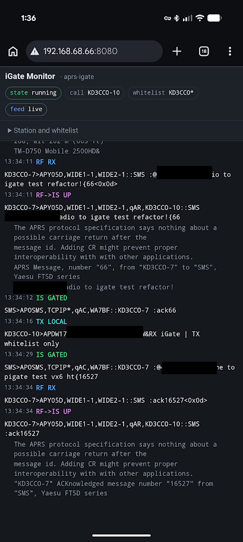
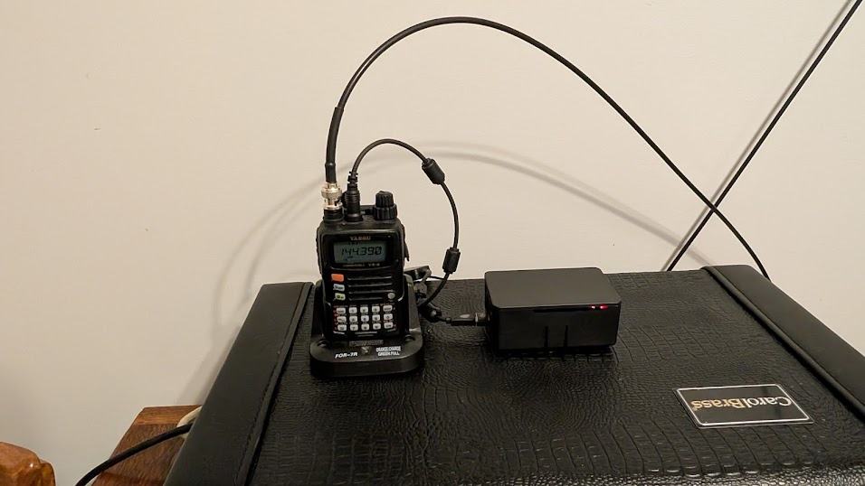
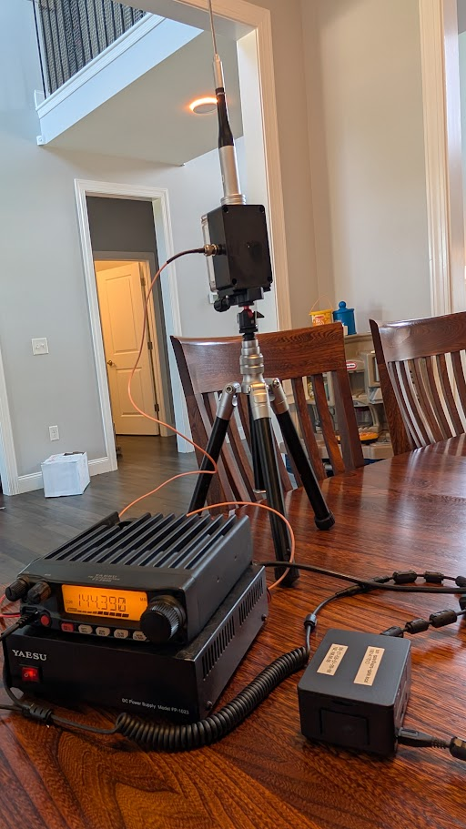

<!-- _class: title -->
<!-- _paginate: false -->
<!-- _footer: "" -->

# A two-way APRS iGate that will only ever transmit to me

**KD3CCO**

Texting a handheld from a phone, without trusting the internet

---


<!-- _class: panel -->

# I wanted to text my wife from a radio where there is no cell coverage

An SMS leaves a phone, crosses the internet, reaches a gateway I own, and comes out of a radio.

The handheld on the left is receiving one. Nothing between the two of us had to be a cell tower.

---


<!-- _class: panel -->

# Half of what I wanted, you can have tonight, without building anything

**Radio to phone already works — for everyone, for free.** NA7Q runs an APRS-to-SMS bridge, documented at **aprs.wiki**. It answers to `SMS` on the air, and to `866-352-4096` from a phone.

1. **Opt the number in** on this form. Ten digits, press the button. It is a carrier requirement — skip it and your messages vanish with **no error anywhere**.
2. **From the radio**, send an APRS message to `SMS` reading `@2125550123 your text`.

No hardware you do not already own. Five minutes.

---


<!-- _class: panel -->

# Then set up an alias, so the number never goes on the air again

APRS is transmitted in clear text and archived publicly, permanently and searchably. Address a phone by its raw number and you publish that number, beside your callsign, on every single message.

Send one message to `SMS`:

```
#alias #add wife 5705550123
```

It answers **"Alias Added."** From then on you address `@wife`, and the number is never transmitted again.

Send that same command from the phone instead, and it never touches RF at all.

---

# Getting a message back to the radio is the half nobody hands you

That bridge will happily carry my text to a phone. Nothing sends one back to me.

Most iGates are **receive only**: they listen on 144.390 and pass what they hear up to the internet. Nothing goes back down. Going the other way means running **a transmitter that traffic from the internet can key** — which is the part worth being careful about, and the reason I built my own rather than asking to enable it on someone else's.

That is the whole project: the return leg.

---

# The rule is one sentence, and everything else follows from it

> Only APRS **messages addressed to a callsign on my whitelist** are ever transmitted.

Positions, telemetry, bulletins, other people's traffic: heard, gated upward, **never keyed onto the air**.

From every other operator's point of view this station is receive-only — so its beacon says exactly that, rather than advertising a relay nobody else can use.

---

<!-- _class: evidence trio -->

# Both directions work, end to end, through the public SMS bridge


<div class="pair">
<figure><figcaption>sent from the radio</figcaption></figure>
<figure><figcaption>both messages, on the phone</figcaption></figure>
<figure><figcaption>the reply, back on the radio</figcaption></figure>
</div>

---

# Four lines of configuration do the work that matters

```
IGFILTER  g/KD3CCO*        ask the servers for that traffic at all
FILTER IG 0 g/KD3CCO*      the whitelist itself, on the addressee
IGMSP     0                no courtesy exceptions
IGTXLIMIT 6 10             a hard cap, whatever else happens
```

`IGMSP 0` is the one I would have missed. Dire Wolf has a courtesy feature that transmits a **message sender's position** after relaying their message — regardless of any filter. I watched it put the SMS gateway's own beacon on the air.

A whitelist with a well-intentioned exception is not a whitelist.

---



<!-- _class: panel -->

# The filter is visible while it works, not just in the config file

A phone in the shack, watching a round trip as it happens: heard on RF, gated up to the internet, the reply gated back down, acknowledged.

Every line is labeled with the direction it went, which is how three separate faults were eventually cornered.

---

<!-- _class: evidence -->

# It is a box you plug in and forget



<span class="caption">Raspberry Pi 3B+, a handheld in its charger, a \$35 USB sound-card interface. No keyboard, no monitor.</span>

---

# It now tests itself every four hours and says which link failed

```
step 1 OK: APRS-IS accepted it
step 2 OK: the server routed it back to this gateway
step 3 OK: the gateway transmitted it
step 4 OK: KD3CCO-7 acknowledged it over RF

PASS — a message from the internet reached KD3CCO-7 and was acknowledged.
```

A beacon proves the transmitter keys. **Only an acknowledged message proves the station can do the thing it exists for** — and this one had spent hours beaconing happily while unable to deliver anything.

---

# The faults that cost the most were not in the software

**An adapter cable plugged in backwards.** Three conductors into a four-conductor socket grounded the PTT line, so the radio keyed a dead carrier until its own timeout, then refused to transmit. Receive was perfect. Every log said the messages were sent.

**RF from its own antenna, knocking the sound card off the USB bus** — one reset every other transmission. A choke at the feedpoint and the antenna outside fixed it at full power.

---



<!-- _class: panel -->

# The third fault was the antenna, and no amount of power was going to fix it

A mobile whip on a tripod, indoors, with no ground plane — so the coax braid was doing the radiating.

Raising power changed nothing measurable. An end-fed half-wave outside, several meters from the radio, changed everything the software could not.

---

<!-- _class: evidence -->

# An AI coding assistant reads your whole repository, and that changes which projects are worth starting


Hobby time arrives as confetti: twenty minutes before dinner, an hour on a Sunday. What decides whether a project happens is not the work in it — it is how much progress fits inside one of those fragments. A gateway that tests its own delivery every four hours was never going to happen otherwise.

---

<!-- _class: evidence -->

# The gain is not just faster and better code — it is the practices the AI made affordable


<span class="caption">Interfaces, failure modes and what happens when a part is missing, all decided in the document before anything exists. Here that produced a `selftest` that proves delivery end to end, and a `reach` that measures which digipeaters hear me — out of logs I already had.</span>

---

# Its best trick is telling me what I did not know to ask

**Argue with it for an hour at two in the morning** without spending a friend's patience. In a solo hobby, that back-and-forth was the scarce ingredient.

**Then turn it against your own design.** I write down how I think something should work, and ask for an analysis of alternatives — and specifically: *does this design imply there are tools, techniques or facts out there that I am not accounting for?*

It is a retrieval system over what other people have already worked out. Use it as one.

---

<!-- _class: evidence -->

# Code, documentation, slides and the blog in one window, where the assistant can see all of it


<span class="caption">Documentation is markdown in the repository, beside the code. Everything advances in the same sitting, so nothing drifts. The blog is another repository in the same workspace; these slides are markdown in this one.</span>

---

<!-- _class: closing -->

# A receive-only iGate is an afternoon, and your neighbors will thank you

**Code, four quickstarts, and a step-by-step Pi build**
github.com/hatandspecs/aprs_igate_bidirectional_whitelist

**Write-up, including everything that went wrong**
hatandspecs.github.io/hamradio/articles/aprs-igate-bidirectional-whitelist/

Runs in Docker on a laptop, or bare-metal on a \$35 Pi.

**KD3CCO** — questions welcome
