<!-- _class: title -->
<!-- _paginate: false -->
<!-- _footer: "" -->

# A two-way APRS iGate that only transmits to my whitelist

**KD3CCO**

Bi-directional cell phone to HT text messaging

---

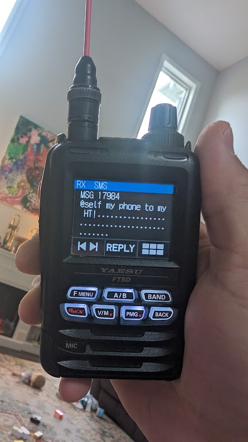

<!-- _class: panel -->

# I wanted to text my wife from a radio where there is no cell coverage

An SMS leaves a phone, crosses the internet, reaches a gateway I own, and comes out of a radio.

The phone end is an ordinary text message. **The radio end needs no cell service.** That last leg is the project.

---

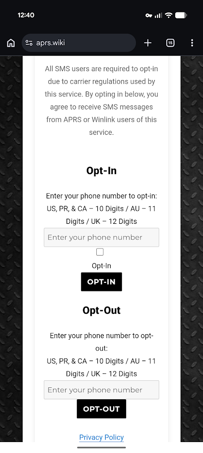

<!-- _class: panel -->

# Radio to phone already works, free, with no hardware

**Radio to phone already works — for everyone, for free.** NA7Q runs an APRS-to-SMS bridge, documented at **aprs.wiki**. It answers to `SMS` on the air, and to `866-352-4096` from a phone.

1. **Opt the number in** on this form. Ten digits, press the button. It is a carrier requirement — skip it and your messages vanish with **no error anywhere**.
2. **From the radio**, send an APRS message to `SMS` reading `@2125550123 your text`.

Five minutes, using the radio you have.

---

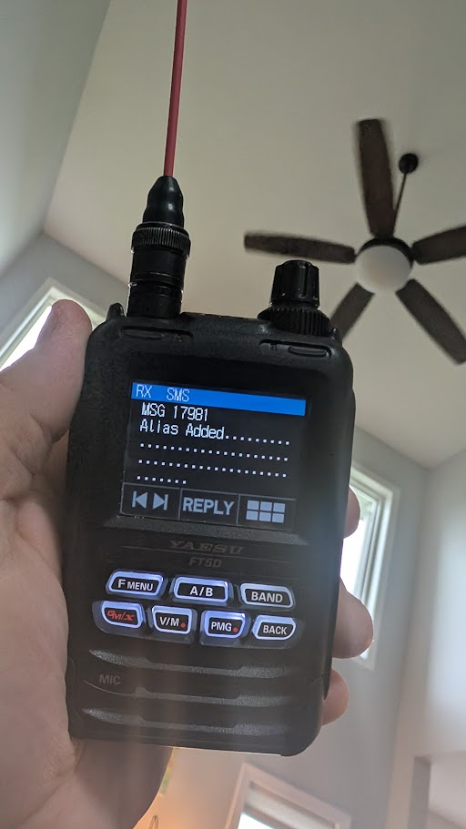

<!-- _class: panel -->

# Then set up an alias, so the number never goes on the air again

APRS is transmitted in clear text and archived publicly. Address a phone by its raw number and you publish that number, beside your callsign, on every single message.

Send one message to `SMS`:

```
#alias #add wife 5705550123
```

It answers **"Alias Added."** From then on you address `@wife`, and the number is never transmitted again.

Send that same command from the phone instead, and it never touches RF at all.

---

# Getting a message back to the radio is the half you need to build yourself

That bridge carries my text to a phone. Nothing sends one back to me.

Most iGates are **receive only**: they listen on 144.390 and pass what they hear up to the internet. Nothing goes back down. Going the other way means running **a transmitter that traffic from the internet can key.** That is why I built my own instead of asking someone to enable it on theirs.

---

<!-- _class: evidence -->

# For my iGate, only APRS messages addressed to a callsign on my whitelist are ever transmitted

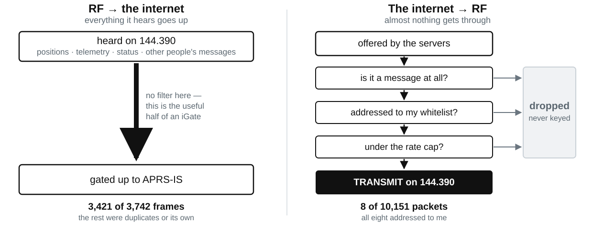

<span class="caption">Measured over thirty hours. From every other operator's point of view this station is receive-only, so its beacon says receive-only.</span>

---

<!-- _class: evidence trio -->

# Both directions work, end to end, through the public SMS bridge

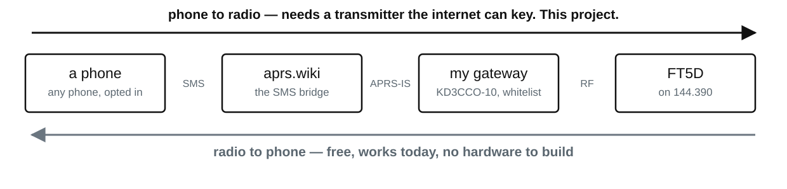

<div class="pair">
<figure>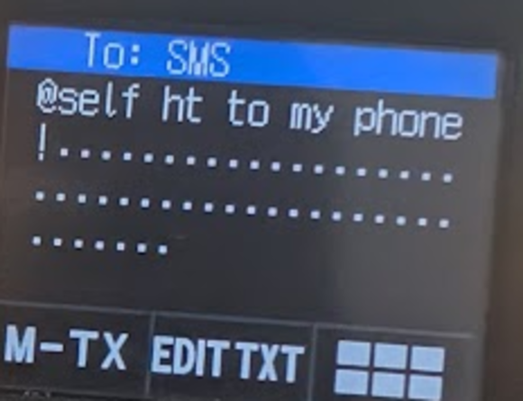<figcaption>sent from the radio</figcaption></figure>
<figure>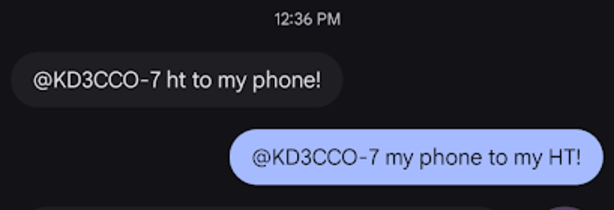<figcaption>both messages, on the phone</figcaption></figure>
<figure>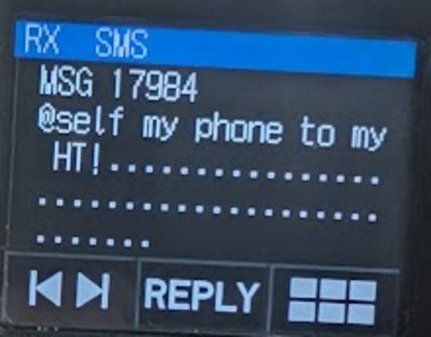<figcaption>the reply, back on the radio</figcaption></figure>
</div>

---

# Four lines of configuration do the work that matters

```
IGFILTER  g/KD3CCO*        ALSO send me messages for these calls
FILTER IG 0 g/KD3CCO*      what I will put ON THE AIR — the whitelist
IGMSP     0                no courtesy exceptions to it
IGTXLIMIT 6 10             at most 6 packets a minute, 10 in five
```

**`IGFILTER` widens what arrives; it does not narrow it.** APRS-IS already sends an iGate traffic involving stations it has recently gated up — which is most of what you see arriving and being dropped. This *adds* a subscription: send me messages for my calls **whether or not I have heard that station lately**. Without it the downlink only reaches somebody already in earshot, which is the opposite of the point.

**`FILTER IG 0` is the gate.** It decides what reaches the transmitter. That one is the guarantee.

`IGTXLIMIT` is a hard ceiling whatever the rest of the config says — and Dire Wolf **drops** packets over it rather than queueing them.

`IGMSP 0` is the one I would have missed. Dire Wolf has a courtesy feature that transmits a **message sender's position** after relaying their message — regardless of any filter. I watched it put the SMS gateway's own beacon on the air.

---

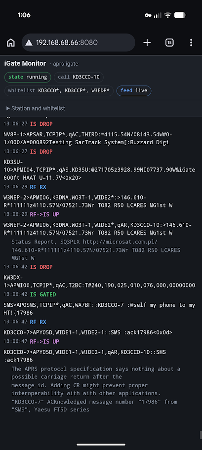

<!-- _class: panel -->

# The monitor shows every packet and which direction it went

A phone in the shack, watching a round trip as it happens. `IS GATED` in green is the one packet the whitelist let onto the air; five seconds later the handheld's acknowledgement comes back on RF.

Over thirty hours the servers offered this station **10,151 packets. Eight reached the air** — every one a message to a whitelisted call. The other transmissions were its own beacons.

Every line is labeled with the direction it went, which is how I found three separate faults.

---

<!-- _class: evidence -->

# It is a box you plug in and forget

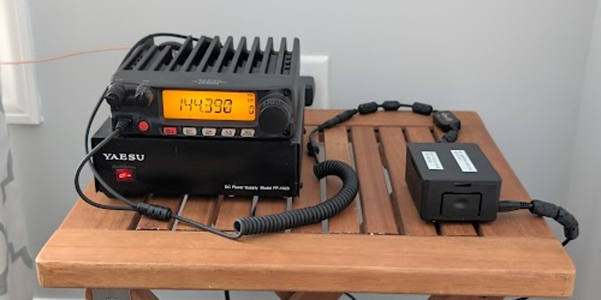

<span class="caption">A Raspberry Pi 3B+, a \$35 USB sound-card interface, and a mobile radio, on a side table in a spare room. No keyboard, no monitor, no screen.</span>

---

# It now tests itself every four hours and says which link failed

```
step 1 OK: APRS-IS accepted it
step 2 OK: the server routed it back to this gateway
step 3 OK: the gateway transmitted it
step 4 OK: KD3CCO-7 acknowledged it over RF

PASS — a message from the internet reached KD3CCO-7 and was acknowledged.
```

A beacon proves the transmitter keys. **Only an acknowledged message proves delivery.** This station spent hours beaconing normally while delivering nothing.

---
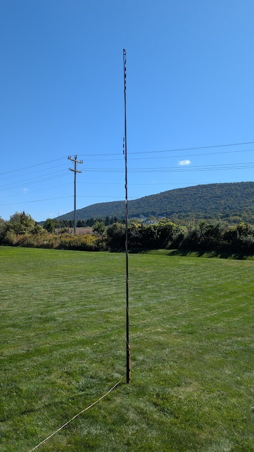

<!-- _class: panel -->

# The three faults that cost the most were none of them software

**An adapter cable in backwards.** Three conductors into a four-conductor socket grounded the PTT line, so the radio keyed a dead carrier until its own timeout. Receive was perfect and every log said the messages were sent.

**RF from its own antenna**, knocking the sound card off the USB bus — one reset every other transmission.

**An antenna that was not one.** A mobile whip indoors, sold as needing no ground plane, which still needed far more counterpoise than I gave it: the coax braid ended up doing the radiating. Eight decibels more power bought nothing.

All three were fixed by a slim jim up a fifteen-foot mast in the yard, a choke at the feedpoint, and a cable the right way round. **I guess I really am an amateur at this radio stuff.**

---
<!-- _class: evidence -->

# Drive level into the radio sets deviation — mine calibrated to 2.8 kHz

<div class="split">
<div>

$$BW = 2\,(\Delta f + f_{\max})$$

$$\Delta f = \frac{BW}{2} - f_{\max}$$

$$\Delta f = \frac{10\;\text{kHz}}{2} - 2.2\;\text{kHz} = 2.8\;\text{kHz}$$

**Method:** key up, read the occupied bandwidth off any band scope — 10 kHz here — and solve for $\Delta f$ with $f_{\max}$ at 2200 Hz, the higher APRS tone. Adjust the Digirig's drive level, repeat until **2.5 to 3.0 kHz**.

Much past 3 and the radio's voice processing takes over: pre-emphasis, deviation limiter, splatter filter. All of it built so clipped speech still sounds right. AFSK is two tones that must stay balanced, and one bad bit discards the whole packet.

</div>
<div>

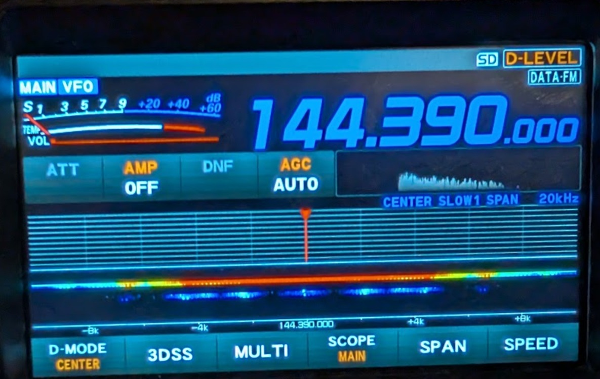

</div>
</div>

---

# What it takes, if you want one

**The gateway** — a Raspberry Pi 3B+, a microSD card, a 5 V supply.

**The radio interface** — a Digirig Lite, about \$35, and the cable for your radio. Mine was plugged in backwards for four hours.

**A 2 m radio** that will sit on 144.390 and accept external PTT. An FT-2900R here; a VX-6R and a Radtel both work on the same profile.

**A real antenna** — a slim jim outside, with a choke at the feedpoint. This mattered more than any software I wrote.

No CAT cable, no GPS, no display, no keyboard, no monitor — ever. **Try the whole thing in Docker on a laptop first**, before buying any of it.

---
<!-- _class: evidence -->

# AI helps with faster code and better documentation practices


Hobby time arrives as confetti, so what decides whether a project happens is how much progress fits in twenty minutes. Writing the requirements down first, numbering them, and keeping an honest status used to be the part you skipped; it stops being overhead when the tedium is cheap.

**Its best trick is telling me what I did not know to ask** — write down how you think something should work, then ask what the alternatives are and what you are not accounting for.

---

<!-- _class: evidence -->

# Code, documentation, slides and the blog in one window, where the assistant can see all of it


<span class="caption">Documentation is markdown in the repository, beside the code. Everything advances in the same sitting, so nothing drifts. The blog is another repository in the same workspace; these slides are markdown in this one.</span>

---

<!-- _class: closing -->

# A text message to a radio, where there is no cell service

When I am out past coverage with a handheld, somebody at home can reach me, and I can answer — through my own gateway

**Code, four quickstarts, and a step-by-step Pi build**
github.com/hatandspecs/aprs_igate_bidirectional_whitelist

**Write-up, including everything that went wrong**
hatandspecs.github.io/hamradio/articles/aprs-igate-bidirectional-whitelist/

Runs in Docker on a laptop, or bare-metal on a \$35 Pi.

**KD3CCO** — questions welcome
